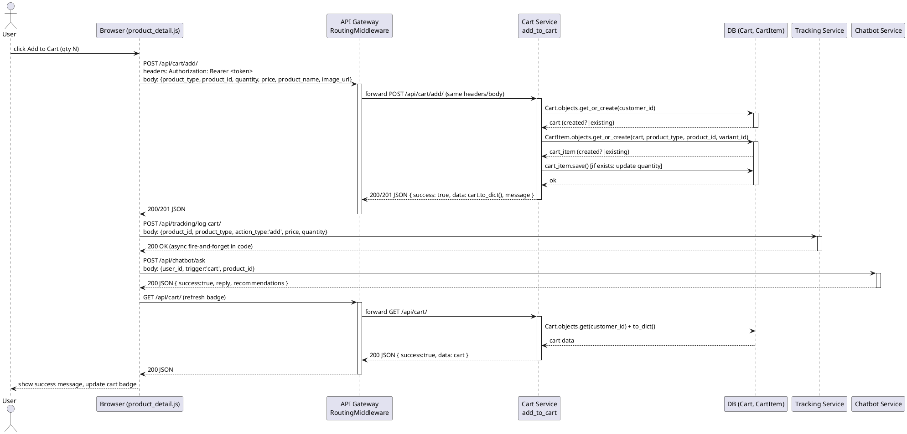
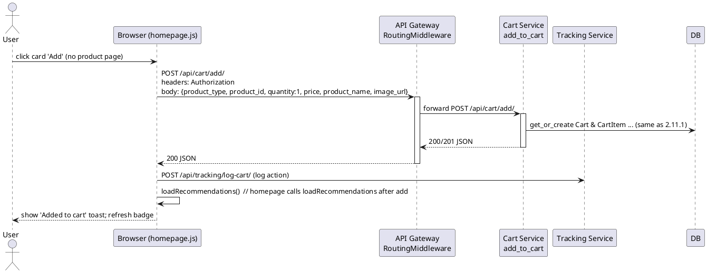
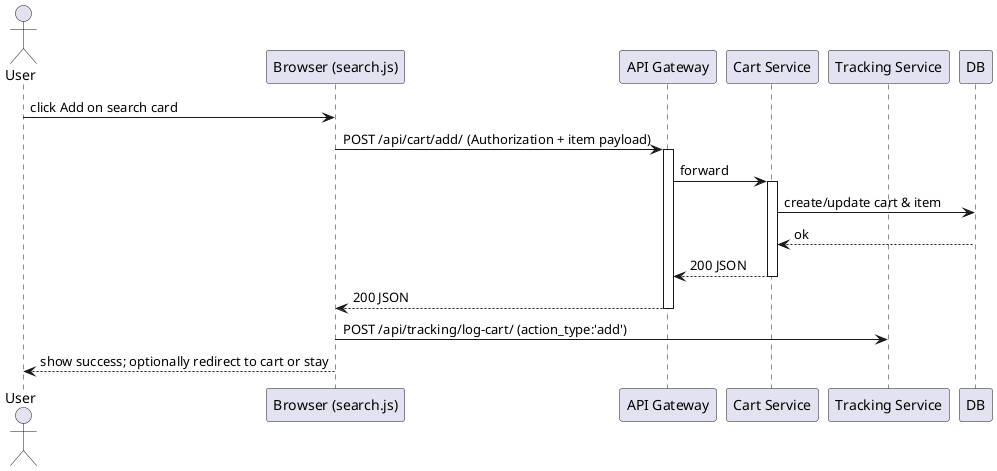
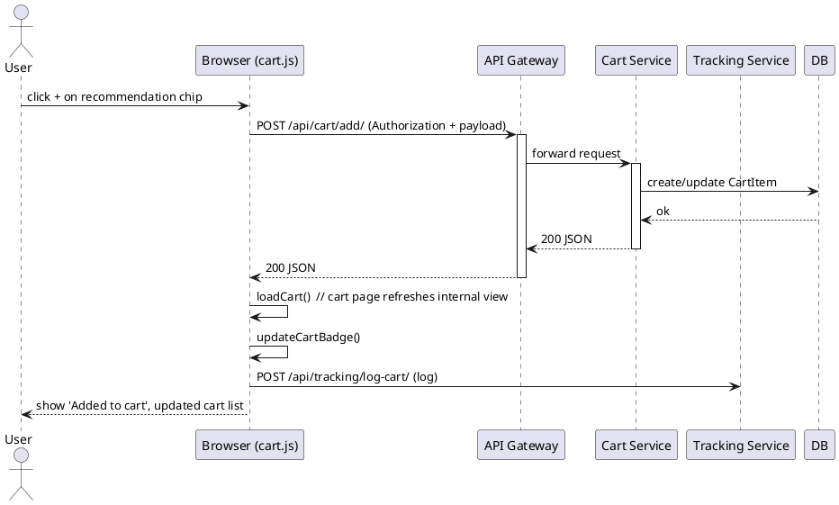
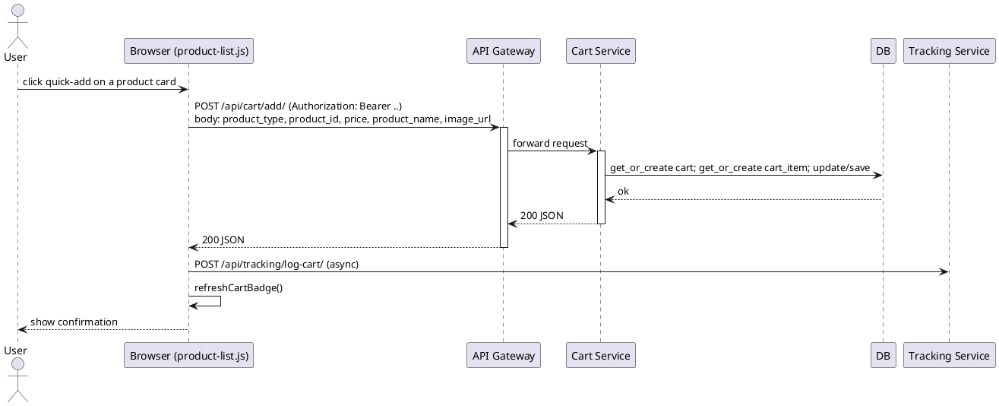

# 2.11 Sequence diagrams — Product view & Add-to-cart flows

Tập hợp 5 luồng phổ biến liên quan tới "Xem sản phẩm" và "Thêm vào giỏ hàng". Mỗi sơ đồ là PlantUML sequence diagram, được viết dựa trên code thực tế:

- Frontend JS (templates /*product_detail.html, homepage.html, search.html, cart.html*/)
- API Gateway (RoutingMiddleware forwarding /api/cart/ -> cart-service)
- Cart Service (views.add_to_cart in services/cart_service/cart_app/views.py)
- Tracking Service (/api/tracking/*)
- Chatbot Service (/api/chatbot/ask)

Lưu ý: diagram dùng các endpoint và hành vi chính xác từ code: `POST /api/cart/add/`, `GET /api/cart/`, tracking POSTs (`/api/tracking/log-cart/`, `/api/tracking/log-view/`) và chatbot `POST /api/chatbot/ask`.

## 2.11.1 Product detail -> Add to cart (full flow)

## 2.11.2 Quick add from Homepage (one-click add)

## 2.11.3 Add from Search results (AJAX add)

## 2.11.4 Add from Recommendations (cart page) — addToCartFromRec

## 2.11.5 Add via client-side quick-action (category list / product cards)

---

Nếu muốn, tôi có thể:

- xuất các PlantUML thành PNG/SVG (cần cài `plantuml`/`java`/`dot` trên máy), hoặc
- chuyển sang Mermaid sequence diagrams (natively renderable in some markdown viewers).

Muốn tôi render sang ảnh không? (tôi có thể tạo file `.puml` và hướng dẫn lệnh chạy).
