# Activity Diagrams

File này vẽ lại 3 activity diagram từ các sequence trong `docs/images/image.png`, `docs/images/image1.png`, `docs/images/image2.png`.

Thay vì PlantUML activity diagram, các sơ đồ dưới đây dùng **Mermaid flowchart LR** để dễ render theo chiều ngang trong Markdown/report. Mỗi `subgraph` tương ứng với một thành phần tham gia xử lý.

---

## 1. Activity Diagram: Xem sản phẩm, thêm giỏ và gợi ý AI

```mermaid
flowchart LR
    Start([Start]) --> C1

    subgraph Customer["Khach hang"]
        direction TB
        C1["Mo trang san pham<br/>hoac bam san pham goi y"]
        C2["Chon variant va so luong"]
        C3["Bam Add to Cart"]
    end

    subgraph Browser["Browser / Web UI"]
        direction TB
        B1["Doc product_id tu URL"]
        B2["GET /api/products/{product_id}"]
        B3{"Product load thanh cong?"}
        B4["Render ten, gia, anh,<br/>mo ta, thong so, variants"]
        B5["Background tracking:<br/>POST /api/tracking/log-view/"]
        B6{"Da dang nhap?"}
        B7{"Da chon variant?"}
        B8["Tao cart payload:<br/>product_id, variant_id, quantity,<br/>price, product snapshot"]
        B9["POST /api/cart/add/<br/>Authorization Bearer token"]
        B10["Thong bao can dang nhap<br/>va dieu huong /login/"]
        B11["Thong bao can chon variant"]
        B12["Cap nhat cart badge<br/>Hien thi Added to cart"]
        B13["Goi loadRecommendations()"]
        B14["Render AI recommendation cards"]
        BERR["Hien thi loi<br/>quay ve homepage"]
    end

    subgraph Gateway["API Gateway"]
        direction TB
        G1["Route /api/products/*<br/>sang product-service"]
        G2["Route /api/tracking/*<br/>sang tracking-service"]
        G3["Route /api/cart/add/<br/>sang cart-service"]
        G4["Route /api/recommendations/{user_id}<br/>sang recommendation-service"]
    end

    subgraph Product["Product Service"]
        direction TB
        P1["Tim Product theo id"]
        P2{"Product ton tai?"}
        P3["Lay Category, Product Type,<br/>Attributes, Variants, Stock"]
        P4["Chuan hoa payload hien thi"]
    end

    subgraph Tracking["Tracking Service"]
        direction TB
        T1["Tao ProductView"]
        T2["Tao TrackingEvent ClickProduct"]
        T3["Tao CartAction action=add"]
        T4["Tao TrackingEvent AddToCart"]
    end

    subgraph Cart["Cart Service"]
        direction TB
        CA1["Verify JWT customer"]
        CA2{"Token hop le?"}
        CA3["Validate payload"]
        CA4["Get or create Cart theo customer_id"]
        CA5{"Item cung product + variant da co?"}
        CA6["Tang quantity"]
        CA7["Tao CartItem moi<br/>kem product snapshot"]
        CA8["Tra ve cart moi"]
        CAERR["Tra loi loi xac thuc"]
    end

    subgraph Rec["Recommendation Service"]
        direction TB
        R1["Lay current cart tu cart-service"]
        R2["Lay don hang gan day tu order-service"]
        R3["Lay tracking history tu tracking-service"]
        R4["Gop, khu trung lap,<br/>lay toi da 20 hanh vi gan nhat"]
        R5["Tao context_text tu lich su"]
        R6["Lay graph candidates tu Neo4j<br/>bo qua cart/bought products"]
        R7["Neu GRU san sang:<br/>score candidates bang model"]
        R8["Neu GRU loi:<br/>fallback graph_score"]
        R9["Gop Qdrant + Graph/GRU"]
        R10{"Co recommendation?"}
        R11["Enrich product payload"]
        R12["Fallback popular products<br/>hoac Product Service"]
    end

    subgraph Search["Recommendation Search Service / Qdrant"]
        direction TB
        S1["Encode context_text"]
        S2["Search Qdrant collection products"]
        S3["Tra semantic candidates"]
    end

    C1 --> B1 --> B2 --> G1 --> P1 --> P2
    P2 -->|Co| P3 --> P4 --> B3
    P2 -->|Khong| BERR --> End1([End])
    B3 -->|Co| B4 --> B5 --> G2 --> T1 --> T2 --> C2 --> C3 --> B6
    B6 -->|Khong| B10 --> End2([End])
    B6 -->|Co| B7
    B7 -->|Khong| B11 --> End3([End])
    B7 -->|Co| B8 --> B9 --> G3 --> CA1 --> CA2
    CA2 -->|Khong| CAERR --> End4([End])
    CA2 -->|Co| CA3 --> CA4 --> CA5
    CA5 -->|Co| CA6 --> CA8
    CA5 -->|Khong| CA7 --> CA8
    CA8 --> T3 --> T4 --> B12 --> B13 --> G4 --> R1 --> R2 --> R3 --> R4
    R4 --> R5 --> S1 --> S2 --> S3 --> R9
    R4 --> R6 --> R7 --> R8 --> R9
    R9 --> R10
    R10 -->|Co| R11 --> B14 --> End5([End])
    R10 -->|Khong| R12 --> B14
```

---

## 2. Activity Diagram: Checkout, tạo đơn, thanh toán và tracking

```mermaid
flowchart LR
    Start([Start]) --> C1

    subgraph Customer["Khach hang"]
        direction TB
        C1["Mo trang checkout"]
        C2["Nhap voucher neu co"]
        C3["Chon dia chi"]
        C4["Chon payment_method"]
        C5["Bam Place Order"]
    end

    subgraph Browser["Browser / Checkout UI"]
        direction TB
        B1{"Co access_token?"}
        B2["GET /api/customer/address/"]
        B3["GET /api/cart/"]
        B4{"Co dia chi?"}
        B5["Render danh sach dia chi"]
        B6["Hien thi form them dia chi"]
        B7["POST /api/customer/address/add/"]
        B8{"Cart co item?"}
        B9["Render order summary<br/>Tinh cartTotal"]
        B10["POST /api/vouchers/validate/"]
        B11{"Voucher hop le?"}
        B12["Cap nhat discount<br/>va final total"]
        B13["Hien thi voucher invalid"]
        B14{"Da chon dia chi?"}
        B15["POST /api/orders/place/"]
        B16["Hien thi Order placed successfully"]
        B17["Dieu huong /orders/?success=true"]
        B18["POST /api/payments/process/"]
        BERR1["Dieu huong /login/"]
        BERR2["Thong bao gio hang rong"]
        BERR3["Thong bao can chon dia chi"]
    end

    subgraph Gateway["API Gateway"]
        direction TB
        G1["Route customer/cart/voucher/order/payment request"]
    end

    subgraph UserSvc["User Service"]
        direction TB
        U1["Verify JWT"]
        U2["Lay danh sach dia chi customer"]
        U3["Tao Address moi neu user them dia chi"]
    end

    subgraph CartSvc["Cart Service"]
        direction TB
        CA1["Verify JWT"]
        CA2["Lay Cart va CartItems"]
        CA3["Tra cart items"]
        CA4["DELETE /api/cart/clear/"]
        CA5["Xoa CartItems cua customer"]
    end

    subgraph VoucherSvc["Voucher Service"]
        direction TB
        V1["Kiem tra code active"]
        V2["Kiem tra thoi han,<br/>usage_limit, min_order_value"]
        V3["Tinh discount_applied"]
        V4["Tra loi invalid"]
    end

    subgraph OrderSvc["Order Service"]
        direction TB
        O1["Verify JWT customer"]
        O2["Lay cart tu cart-service"]
        O3{"Cart rong?"}
        O4["Lay address tu user-service"]
        O5{"address_id hop le?"}
        O6["Validate voucher neu co"]
        O7["Tinh total_amount,<br/>discount_amount, final_amount"]
        O8["Tao Order"]
        O9["Tao OrderItems snapshot:<br/>product_name, variant, image, price"]
        O10["Lap qua tung cart item"]
        OERR1["Tra loi Cart is empty"]
        OERR2["Tra loi Invalid shipping address"]
    end

    subgraph ProductSvc["Product Service"]
        direction TB
        P1["POST /api/products/update-stock/"]
        P2["Tim ProductVariant"]
        P3["Tru stock bang quantity am"]
    end

    subgraph TrackingSvc["Tracking Service"]
        direction TB
        T1["POST /api/tracking/log-purchase/"]
        T2["Tao PurchaseAction cho tung item"]
        T3["Tao TrackingEvent PlaceOrder"]
    end

    subgraph PaymentSvc["Payment Service"]
        direction TB
        Pm1["Verify JWT customer"]
        Pm2["Tao Payment"]
        Pm3["Tao PaymentLog"]
        Pm4["Tra payment status"]
    end

    C1 --> B1
    B1 -->|Khong| BERR1 --> End1([End])
    B1 -->|Co| B2 --> G1 --> U1 --> U2 --> B3 --> G1 --> CA1 --> CA2 --> CA3 --> B4
    B4 -->|Co| B5 --> B8
    B4 -->|Khong| B6 --> B7 --> G1 --> U3 --> B5
    B8 -->|Khong| BERR2 --> End2([End])
    B8 -->|Co| B9 --> C2
    C2 --> B10 --> G1 --> V1 --> V2 --> B11
    B11 -->|Co| V3 --> B12 --> C3
    B11 -->|Khong| V4 --> B13 --> C3
    C3 --> C4 --> C5 --> B14
    B14 -->|Khong| BERR3 --> End3([End])
    B14 -->|Co| B15 --> G1 --> O1 --> O2 --> CA3 --> O3
    O3 -->|Co| OERR1 --> End4([End])
    O3 -->|Khong| O4 --> U2 --> O5
    O5 -->|Khong| OERR2 --> End5([End])
    O5 -->|Co| O6 --> O7 --> O8 --> O9 --> O10
    O10 --> P1 --> P2 --> P3 --> T1 --> T2 --> T3 --> CA4 --> CA5 --> B16 --> B17
    B17 --> B18 --> G1 --> Pm1 --> Pm2 --> Pm3 --> Pm4 --> End6([End])
```

---

## 3. Activity Diagram: Xem đơn hàng và đánh giá sản phẩm

```mermaid
flowchart LR
    Start([Start]) --> C1

    subgraph Customer["Khach hang"]
        direction TB
        C1["Mo trang /orders/"]
        C2["Bam nut Rate"]
        C3["Chon so sao va nhap comment"]
        C4["Submit rating"]
    end

    subgraph Browser["Browser / Orders UI"]
        direction TB
        B1{"Da dang nhap?"}
        B2["GET /api/orders/mine/"]
        B3{"Co don hang?"}
        B4["Render order cards,<br/>items, total, status"]
        B5{"Order delivered?"}
        B6["Hien thi nut Rate cho tung item"]
        B7["GET /api/ratings/order/{order_id}/"]
        B8["Danh dau item da Rated"]
        B9["Mo rating modal"]
        B10{"Da chon sao?"}
        B11["POST /api/ratings/add/"]
        B12["Hien thi Rating submitted"]
        B13["Doi nut thanh Rated"]
        BERR1["Dieu huong /login/"]
        BERR2["Hien thi No orders yet"]
        BERR3["Thong bao can chon sao"]
        BERR4["Hien thi loi rating"]
    end

    subgraph Gateway["API Gateway"]
        direction TB
        G1["Route /api/orders/*<br/>sang order-service"]
        G2["Route /api/ratings/*<br/>sang rating-service"]
    end

    subgraph OrderSvc["Order Service"]
        direction TB
        O1["Verify JWT customer"]
        O2["Lay Orders theo customer_id"]
        O3["Kem OrderItems va ShippingTracking"]
        O4["GET /api/orders/{order_id}/"]
        O5{"Order thuoc customer?"}
        O6["Tra order detail va items"]
        OERR["Tra Order not found"]
    end

    subgraph RatingSvc["Rating Service"]
        direction TB
        R1["Verify JWT customer"]
        R2["Lay ratings cua order va customer"]
        R3["Validate stars 1..5"]
        R4["Goi order-service de xac minh order"]
        R5{"Order da delivered?"}
        R6["Tim item theo product_id,<br/>product_type, variant_id"]
        R7{"Item ton tai trong order?"}
        R8{"Da rating item nay?"}
        R9["Tao Rating trong rating_db"]
        RERR1["Loi: chi danh gia khi delivered"]
        RERR2["Loi: item khong thuoc order"]
        RERR3["Loi: already rated"]
    end

    C1 --> B1
    B1 -->|Khong| BERR1 --> End1([End])
    B1 -->|Co| B2 --> G1 --> O1 --> O2 --> O3 --> B3
    B3 -->|Khong| BERR2 --> End2([End])
    B3 -->|Co| B4 --> B5
    B5 -->|Khong| End3([End])
    B5 -->|Co| B6 --> B7 --> G2 --> R1 --> R2 --> B8 --> C2
    C2 --> B9 --> C3 --> C4 --> B10
    B10 -->|Khong| BERR3 --> End4([End])
    B10 -->|Co| B11 --> G2 --> R1 --> R3 --> R4 --> O4 --> O5
    O5 -->|Khong| OERR --> BERR4 --> End5([End])
    O5 -->|Co| O6 --> R5
    R5 -->|Khong| RERR1 --> BERR4 --> End6([End])
    R5 -->|Co| R6 --> R7
    R7 -->|Khong| RERR2 --> BERR4 --> End7([End])
    R7 -->|Co| R8
    R8 -->|Da co| RERR3 --> BERR4 --> End8([End])
    R8 -->|Chua| R9 --> B12 --> B13 --> End9([End])
```

