# CHƯƠNG 2. Phát triển HệE-Commerce Microservices

## 2.1
Phân tích yêu cầu

Hệ thống E-Commerce được xây dựng nhằm phục vụ các chức năng chính của một

nền tảng thương mại điện tử hiện đại, kết hợp với khả năng tư vấn thông minh từAI. Dưới
đây là phân tích chi tiết các yêu cầu chức năng thông qua sơ đồ Use Case cho Khách hàng
và Nhân viên.

### 2.1.1
Phân tích Use Case Khách hàng

Nhóm chức năng này tập trung vào trải nghiệm mua sắm và tương tác với AI của người
dùng cuối.

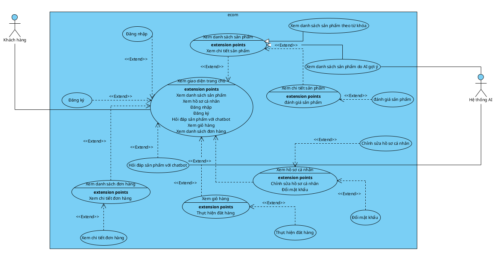

Hình 2.1: Sơ đồ Use Case tổng quan cho Khách hàng

| STT | Use Case | Phân tích yêu cầu chức năng |
| :--- | :--- | :--- |
| 1 | Đăng ký & Đăng nhập | Hệ thống cho phép người dùng tạo tài khoản và xác thực để truy cập các tính năng cá nhân hóa (Customer Context). |
| 2 | Xem danh sách sản phẩm | Hiển thị danh mục sản phẩm, tìm kiếm và nhận các gợi ý từ AI (Catalog & AI Context). |
| 3 | Xem chi tiết sản phẩm | Cung cấp thông tin chi tiết, hình ảnh và cho phép để lại đánh giá, bình luận (Catalog & Comment Context). |
| 4 | Hỏi đáp với Chatbot | Tương tác trực tiếp với trợ lý ảo RAG để được tư vấn sản phẩm và giải đáp thắc mắc (AI Context). |
| 5 | Quản lý giỏ hàng | Thêm, xóa và cập nhật số lượng sản phẩm trước khi mua hàng (Cart Context). |
| 6 | Thực hiện đặt hàng | Quy trình chuyển đổi từ giỏ hàng sang đơn hàng, áp dụng mã giảm giá và xác nhận thông tin (Ordering Context). |
| 7 | Thanh toán đơn hàng | Thực hiện giao dịch thông qua các cổng thanh toán trực tuyến hoặc chọn COD (Payment Context). |
| 8 | Theo dõi vận chuyển | Kiểm tra lộ trình giao hàng và thông tin mã vận đơn (Shipping Context). |
| 9 | Quản lý hồ sơ & Đơn hàng | Cập nhật thông tin cá nhân và xem lại lịch sử các giao dịch đã thực hiện. |

---

STT
Use Case
Phân tích yêu cầu chức năng

Hệ thống cho phép người dùng tạo tài khoản
và xác thực để truy cập các tính năng cá nhân
hóa (Customer Context).

1
Đăng ký & Đăng
nhập

Hiển thịdanh mục sản phẩm, tìm kiếm và
nhận các gợi ý từAI (Catalog & AI Context).

2
Xem danh sách sản
phẩm

3
Xem
chi
tiết
sản

Cung cấp thông tin chi tiết, hình ảnh và cho

phẩm

phép đểlại đánh giá, bình luận (Catalog &
Comment Context).

4
Hỏi đáp với Chatbot
Tương tác trực tiếp với trợ lý ảo RAG để
được tư vấn sản phẩm và giải đáp thắc mắc
(AI Context).

5
Quản lý giỏ hàng
Thêm, xóa và cập nhật số lượng sản phẩm
trước khi mua hàng (Cart Context).

6
Thực hiện đặt hàng
Quy trình chuyển đổi từgiỏ hàng sang đơn
hàng, áp dụng mã giảm giá và xác nhận thông
tin (Ordering Context).

7
Thanh
toán
đơn
hàng

Thực hiện giao dịch thông qua các cổng thanh
toán trực tuyến hoặc chọn COD (Payment

Context).

8
Theo dõi vận chuyển
Kiểm tra lộ trình giao hàng và thông tin mã
vận đơn (Shipping Context).

9
Quản lý hồ sơ & Đơn
hàng

Cập nhật thông tin cá nhân và xem lại lịch sử
các giao dịch đã thực hiện.

### 2.1.2
Phân tích Use Case Nhân viên

Nhóm chức năng này tập trung vào quản trịdữ liệu hệ thống và vận hành AI.

---

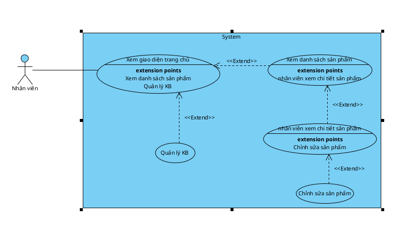

Hình 2.2: Sơ đồ Use Case tổng quan cho Nhân viên

| STT | Use Case | Phân tích yêu cầu chức năng |
| :--- | :--- | :--- |
| 1 | Xem giao diện quản trị | Giao diện tổng quan, tích hợp các lối tắt đến quản lý sản phẩm và vận hành hệ thống (Staff Context). |
| 2 | Quản lý danh mục & sản phẩm | Cập nhật thông tin, giá cả và số lượng tồn kho của các mặt hàng (Catalog Context). |
| 3 | Quản lý KB (Knowledge Base) | Cập nhật dữ liệu tri thức cho AI để nâng cao chất lượng tư vấn của Chatbot (AI Context). |
| 4 | Điều phối Đơn hàng & Vận chuyển | Tiếp nhận đơn hàng mới, cập nhật trạng thái và quản lý thông tin giao hàng (Ordering & Shipping Context). |
| 5 | Giám sát Thanh toán | Theo dõi các luồng tiền, xác nhận giao dịch và xử lý các vấn đề liên quan đến thanh toán (Payment Context). |
| 6 | Quản lý Đánh giá | Kiểm duyệt và phản hồi các bình luận, đánh giá từ phía khách hàng (Comment Context). |

### 2.1.3
Tương tác hệ thống bổ trợ

• Hệ thống AI: Đóng vai trò là Actor phụ, cung cấp dữ liệu cho các Use Case liên
quan đến Gợi ý sản phẩm và Chatbot.

### 2.1.4
Non-functional Requirements

Bên cạnh các chức năng, hệ thống cần đảm bảo các yêu cầu phi chức năng sau:

• Khảnăng mở rộng (Scalability): Hỗ trợ tăng tải theo từng service và có khả năng
mở rộng ngang (Horizontal Scaling).

• Hiệu năng (Performance): Thời gian phản hồi nhanh, hỗ trợxửlý nhiều người

---

dùng đồng thời, tối ưu truy vấn dữ liệu và caching.

• Tính sẵn sàng (Availability): Hệ thống hoạt động ổn định, giảm thiểu thời gian
downtime.

• Bảo mật (Security): Xác thực và phân quyền, bảo vệthông tin thanh toán, mã hóa
dữ liệu nhạy cảm, chống tấn công SQL Injection, XSS, CSRF.

• Khảnăng bảo trì (Maintainability): Dễnâng cấp và mở rộng, code tổ chức rõ

ràng, hỗ trợlogging và monitoring.

• Khảnăng chịu lỗi (Fault Tolerance): Hệ thống không bị sập toàn bộkhi một
service gặp lỗi, có cơ chế retry và backup.

• Tính nhất quán dữ liệu (Data Consistency): Đảm bảo dữ liệu đơn hàng/thanh
toán không sai lệch, đồng bộ dữ liệu giữa các service.

• Khảnăng triển khai (Deployability): Hỗ trợ Docker/Kubernetes, dễ dàng tích hợp
CI/CD.

## 2.2
Phân rã hệ thống thành các service

Đểxây dựng một hệ thống E-Commerce hiện đại có khả năng mở rộng cao và tích hợp
trí tuệnhân tạo, chúng tôi áp dụng phương pháp thiết kế hướng miền (Domain-Driven

Design - DDD). Hệ thống được phân rã thành các đơn vịnghiệp vụđộc lập thông qua hai
bước chính: xác định các vùng ngữ cảnh (Bounded Context) và ánh xạchúng sang kiến
trúc Microservices.

### 2.2.1
Xác định các Bounded Context

Dựa trên phân tích các hoạt động nghiệp vụthực tế, hệ thống được chia thành 09
Bounded Context cốt lõi:

• Customer Context: Chịu trách nhiệm quản lý toàn bộ vòng đời của khách hàng.
Ngữ cảnh này không chỉbao gồm các tính năng cơ bản như đăng ký, đăng nhập mà
còn tập trung vào việc quản lý các sở thích cá nhân (personal preferences) và hành
vi người dùng, cung cấp dữ liệu nền tảng quan trọng đểphục vụ các dịch vụAI cá
nhân hóa.

• Staff Context: Tập trung hoàn toàn vào các nghiệp vụquản trị và vận hành hệ thống
nội bộ. Vùng này xửlý việc phân quyền nhân viên (RBAC), kiểm soát các hoạt
động quản lý danh mục, đơn hàng và giám sát toàn bộ luồng vận hành của hệ thống
Microservices đểđảm bảo tính an toàn.

• Catalog Context: Đóng vai trò là trung tâm dữ liệu sản phẩm. Nó quản lý thông tin
chi tiết về sản phẩm, cấu trúc danh mục (Category) và tình trạng tồn kho hàng hóa
(Inventory), đảm bảo tính nhất quán và chính xác của dữ liệu khi hiển thị đến khách

---

hàng.

• Cart Context: Chuyên biệt cho việc quản lý trạng thái mua sắm tạm thời của khách
hàng. Ngữ cảnh này xửlý các hoạt động thêm, xóa, cập nhật số lượng sản phẩm
trong giỏ hàng và lưu trữthông tin giỏ hàng theo từng định danh người dùng.

• Ordering Context: Tập trung vào quy trình chuyển đổi từgiỏ hàng sang đơn hàng
chính thức. Ngữ cảnh này xửlý việc tạo đơn hàng, tính toán tổng tiền và cập nhật
trạng thái vòng đời đơn hàng.

• Payment Context: Quản lý quy trình thanh toán của hệ thống. Ngữ cảnh này chịu
trách nhiệm tích hợp các giải pháp thanh toán trực tuyến (như VNPAY, MoMo), xử
lý xác thực giao dịch và lưu trữ lịch sửthanh toán.

• Shipping Context: Phụ trách các nghiệp vụliên quan đến vận chuyển hàng hóa. Bao

gồm việc tính phí giao hàng, lựa chọn đơn vị vận chuyển, tạo mã vận đơn (Tracking
Number) và cập nhật lộ trình giao hàng đến khách hàng.

• AI Service Context: Một thành phần đặc thù phụ trách các tính năng thông minh
của hệ thống. Vùng này bao gồm hệ thống gợi ý sản phẩm dựa trên các mô hình
Deep Learning, Chatbot hỗ trợtư vấn mua sắm sử dụng công nghệRAG và quản trị

cơ sởtri thức (Knowledge Base) đểcung cấp thông tin chính xác nhất.

• Comment Context: Quản lý các tương tác và phản hồi của khách hàng sau khi trải
nghiệm sản phẩm. Nó xửlý việc gửi bình luận, đánh giá chất lượng và hệ thống chấm
điểm sản phẩm (Rating), giúp tăng cường niềm tin và cung cấp dữ liệu phản hồi cho

hệ thống quản trị.

### 2.2.2
Shared Kernel

Đểđảm bảo tính nhất quán dữ liệu giữa các Bounded Context khác nhau mà không
làm tăng tính phụ thuộc (Coupling) quá mức, chúng tôi xác định một thành phần dùng
chung gọi là Shared Kernel.

• Address Shared Kernel: Định nghĩa cấu trúc địa chỉ dùng chung cho toàn hệ thống.
Thành phần này bao gồm các thuộc tính: receiver_name, phone_number,
province_city, district, ward, street_address.

• Ứng dụng: Được chia sẻ giữa Customer Context (quản lý sổ địa chỉ của khách
hàng) và Shipping Context (địa chỉ giao hàng cụ thểcho từng đơn hàng).

Dưới đây là bảng tổng hợp các thành phần cốt lõi trong từng Bounded Context bao

gồm Aggregate Root, các Entity và Value Object tương ứng:

| Bounded Context | Aggregate Root | Entities | Value Objects |
| :--- | :--- | :--- | :--- |
| Customer Context | User, Profile | User, Profile | Address (Shared Kernel) |
| Staff Context | Staff | Staff, Role, Permission, PermissionRole | AccessScope, AuditLogEntry |
| Catalog Context | Product | Product, Category, Brand, Tag, ProductTag, ProductImage | Price, SKU, Stock, Attributes (JSON) |
| Cart Context | Cart | Cart, CartItem | Quantity, AddedAt |
| Ordering Context | Order | Order, OrderItem | OrderStatus, Money |
| Payment Context | Payment | Payment, PaymentMethod, TransactionRecord | PaymentMethod, Amount, Status |
| Shipping Context | Shipment | Shipment, Carrier | TrackingNumber, Status |
| AI Service Context | KnowledgeBase | KnowledgeDocument, ChatSession | VectorEmbedding, ConfidenceScore |
| Comment Context | Review | Review, Comment | Rating, Content |

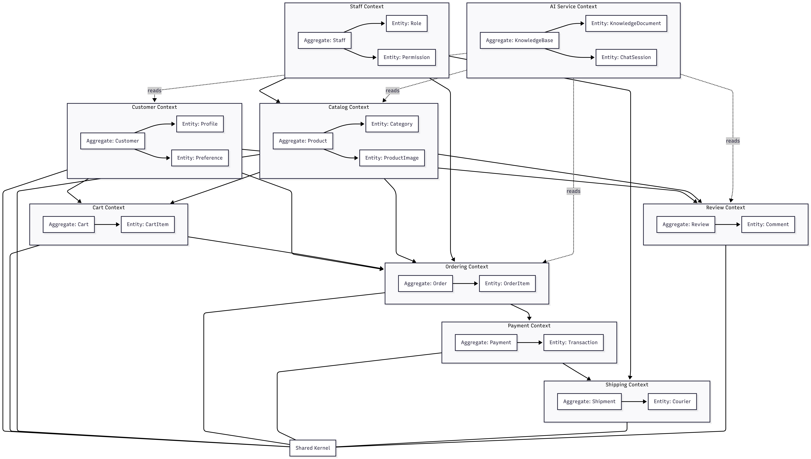

Hình 2.3: Mô hình phân rã Bounded Context của hệ thống theo DDD

---

### 2.2.3
Xác định các lớp thực thểchi tiết cho từng Bounded Context

Dựa trên phân tích yêu cầu chức năng và các Bounded Context đã xác định, chúng tôi
cụ thểhóa các lớp thực thể(Entity Classes) cùng các thuộc tính cốt lõi của chúng:

1. Customer Context:

• User: id, username, password, email, date_joined.

• Profile: id, full_name, phone_number, gender, address_list (Address[]).

2. Staff Context:

• Staff: id, employee_id, full_name, department.

• Role: id, name, description.

• Permission: id, code, name, description.

• PermissionRole: id, permission_id, role_id.

3. Catalog Context:

• Product: id, name, description, price, sku, stock, category_id, attributes
(JSON).

• Category: id, name, description.

• Brand: id, name.

• Tag: id, name, slug.

• ProductTag: id, product_id, tag_id.

• ProductImage: id, product_id, image_url.

4. Cart Context:

• Cart: id, user_id, created_at, attribute.

• CartItem: id, cart_id, product_id, quantity, added_at.

5. Ordering Context:

• Order: id, user_id, total_amount, status, created_at.

• OrderItem: id, order_id, product_id, quantity, unit_price.

---

6. Payment Context:

• Payment: id, order_id, amount, payment_method_id, status, transaction_id.

• PaymentMethod: id, name, description.

• TransactionRecord: id, payment_id, gateway_response, processed_at.

7. Shipping Context:

• Shipment: id, order_id, delivery_address (Address), tracking_number, status,
carrier_id.

• Carrier: id, name, contact_info.

8. AI Service Context:

• KnowledgeDocument: id, title, content, source_url, vector_id.

• ChatSession: id, user_id, start_time, end_time, summary.

9. Comment Context:

• Review: id, product_id, user_id, rating, content, created_at.

• Comment: id, review_id, user_id, content, parent_id.

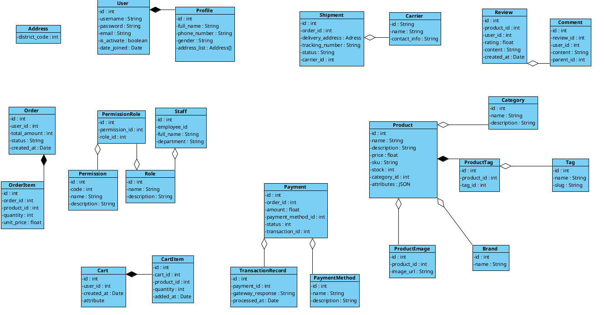

Hình 2.4: Sơ đồ các lớp thực thể(Entity Classes) trong pha phân tích

---

### 2.2.4
Thiết kế hệ thống Microservices theo Bounded Context

Sau khi xác định được các vùng ngữ cảnh, chúng tôi ánh xạchúng thành các
Microservices thực tế. Mỗi service sở hữu cơ sởdữ liệu riêng, đảm bảo tính Loose
Coupling (ghép nối lỏng) và High Cohesion (độgắn kết cao), giúp hệ thống có thể bảo
trì và mở rộng độc lập.

| Bounded Context | Microservice | Trách nhiệm chính |
| :--- | :--- | :--- |
| Customer Context | User Service | Quản lý tài khoản, hồ sơ khách hàng, sổ địa chỉ và kích hoạt tài khoản. |
| Staff Context | Staff Service | Quản trị nhân sự, phân quyền hệ thống (RBAC) và quản lý quyền truy cập. |
| Catalog Context | Product Service | Quản lý thông tin sản phẩm, danh mục, thương hiệu, nhãn (Tag) và kho hàng. |
| Cart Context | Cart Service | Quản lý giỏ hàng và các mặt hàng tạm thời của người dùng. |
| Ordering Context | Order Service | Xử lý quy trình đặt hàng, tính toán giá trị và quản lý vòng đời đơn hàng. |
| Payment Context | Payment Service | Xử lý giao dịch thanh toán, quản lý phương thức thanh toán và lịch sử giao dịch. |
| Shipping Context | Shipping Service | Quản lý đơn vị vận chuyển, tính phí và theo dõi hành trình đơn hàng. |
| AI Service Context | AI Service | Cung cấp Chatbot (RAG), hệ thống gợi ý và quản trị tri thức sản phẩm. |
| Comment Context | Comment Service | Quản lý đánh giá sản phẩm, bình luận và phản hồi từ khách hàng. |

Các Microservices này tuân thủ các nguyên tắc thiết kế cốt lõi bao gồm: giao tiếp
thông qua RESTful API, quyền sở hữu dữ liệu riêng biệt (Data Ownership) và sử dụng
API Gateway làm điểm truy cập duy nhất.

### 2.2.5
Xác định các lớp Controller cho từng Microservice

Trong pha thiết kế chi tiết, chúng tôi xác định các lớp Controller đóng vai trò là ”Lớp
biên”(Boundary) đểtiếp nhận và xửlý các yêu cầu từphía Client. Dưới đây là các lớp
Controller tiêu biểu kèm theo các phương thức chức năng chính:

1. User Service

| Controller | Phương thức | Mô tả |
| :--- | :--- | :--- |
| AuthController | register() | Đăng ký tài khoản người dùng mới. |
| | login() | Xác thực và đăng nhập vào hệ thống. |
| | logout() | Đăng xuất và hủy phiên làm việc. |
| ProfileController | get_profile() | Lấy thông tin chi tiết hồ sơ cá nhân. |
| | update_profile() | Cập nhật thông tin cơ bản (tên, số điện thoại). |
| | add_address() | Thêm địa chỉ giao hàng mới vào sổ địa chỉ. |
| | delete_address() | Xóa địa chỉ giao hàng không còn sử dụng. |

2. Staff Service

| Controller | Phương thức | Mô tả |
| :--- | :--- | :--- |
| StaffManager | list_staff() | Danh sách toàn bộ nhân viên vận hành. |
| | create_staff() | Tạo tài khoản cho nhân sự mới. |
| | update_department() | Điều chuyển nhân viên giữa các phòng ban. |
| | update_status() | Khóa hoặc mở lại tài khoản nhân viên. |
| RBACController | list_roles() | Danh sách các vai trò (Admin, Manager, Staff). |
| | assign_role_to_staff() | Gán vai trò cụ thể cho một nhân viên. |
| | update_role_permissions() | Thay đổi danh sách quyền hạn của một vai trò. |

3. Product Service

| Controller | Phương thức | Mô tả |
| :--- | :--- | :--- |
| CatalogController | list_products() | Lấy danh sách sản phẩm hiển thị trên sàn. |
| | get_product_detail() | Xem chi tiết thông tin và thuộc tính sản phẩm. |
| | filter_by_category() | Lọc danh sách sản phẩm theo danh mục. |
| | search_by_keyword() | Tìm kiếm sản phẩm theo tên hoặc từ khóa. |
| AdminProductController | create_product() | Đăng tải sản phẩm mới lên hệ thống. |
| | update_product() | Chỉnh sửa thông tin sản phẩm hiện có. |
| | delete_product() | Gỡ bỏ sản phẩm khỏi danh sách bán. |
| | update_stock_quantity() | Cập nhật số lượng tồn kho thực tế. |
| | manage_metadata() | Quản lý Brand, Category và các nhãn Tag. |

4. Cart Service

| Controller | Phương thức | Mô tả |
| :--- | :--- | :--- |
| CartController | get_cart() | Lấy danh sách các sản phẩm đang có trong giỏ. |
| | add_item() | Thêm một sản phẩm mới vào giỏ hàng. |
| | update_item_quantity() | Thay đổi số lượng mua của một mặt hàng. |
| | remove_item() | Loại bỏ sản phẩm ra khỏi giỏ hàng. |

5. Order Service

| Controller | Phương thức | Mô tả |
| :--- | :--- | :--- |
| CheckoutController | initiate_checkout() | Bắt đầu quy trình thanh toán đơn hàng. |
| | place_order() | Tạo đơn hàng chính thức vào hệ thống. |
| OrderHistoryController | list_user_orders() | Xem lịch sử tất cả các đơn hàng đã mua. |
| | get_order_detail() | Xem chi tiết trạng thái và các món trong đơn. |
| | cancel_order_request() | Gửi yêu cầu hủy đơn hàng (nếu cho phép). |
| AdminOrderController | list_all_orders() | Quản lý toàn bộ đơn hàng của sàn thương mại. |
| | update_order_status() | Thay đổi trạng thái đơn hàng (Đã xác nhận, Giao hàng). |

6. Payment Service

| Controller | Phương thức | Mô tả |
| :--- | :--- | :--- |
| PaymentController | create_payment_transaction() | Tạo yêu cầu giao dịch thanh toán mới. |
| | handle_gateway_callback() | Xử lý kết quả trả về từ cổng (VNPAY, MoMo). |
| | get_payment_status() | Tra cứu trạng thái thực tế của giao dịch. |
| PaymentMethodController | list_available_methods() | Danh sách các cổng thanh toán đang hoạt động. |

7. Shipping Service

| Controller | Phương thức | Mô tả |
| :--- | :--- | :--- |
| ShipmentController | track_by_number() | Tra cứu lộ trình của kiện hàng theo mã vận đơn. |
| | get_shipping_fee() | Tính phí vận chuyển dựa trên địa chỉ và khối lượng. |
| AdminShippingController | create_shipment_order() | Đẩy thông tin đơn hàng sang đơn vị vận chuyển. |
| | update_tracking_status() | Cập nhật trạng thái giao hàng nội bộ. |
| | manage_carriers() | Quản lý danh sách các đối tác giao hàng. |

8. AI Service

| Controller | Phương thức | Mô tả |
| :--- | :--- | :--- |
| AssistantController | send_query() | Chat với AI (RAG) để tư vấn sản phẩm. |
| | get_chat_history() | Xem lại các cuộc hội thoại tư vấn trước đó. |
| RecommendationController | get_personalized_suggestions() | Lấy danh sách gợi ý sản phẩm cho trang chủ. |
| | get_similar_products() | Gợi ý sản phẩm tương đương trên trang chi tiết. |
| KnowledgeBaseController | index_product_info() | Đồng bộ dữ liệu Catalog sang Vector Database. |

9. Comment Service

| Controller | Phương thức | Mô tả |
| :--- | :--- | :--- |
| ReviewController | submit_review() | Đăng tải nhận xét và số sao cho sản phẩm. |
| | get_product_reviews() | Lấy toàn bộ đánh giá của một sản phẩm cụ thể. |
| CommentController | post_reply() | Phản hồi lại đánh giá của khách hàng. |
| | moderate_comment() | Ẩn/hiện các bình luận vi phạm chính sách. |

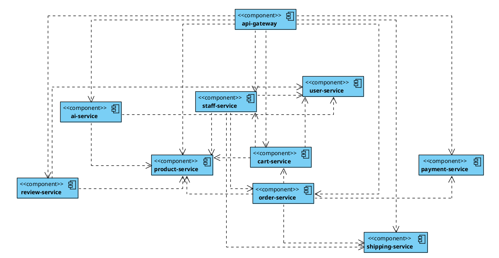

Hình 2.5: Sơ đồ mối quan hệ và tương tác giữa các Microservices

Mô tảhệ thống:
Hệ thống gồm 09 microservices tương tác qua API Gateway bằng giao thức REST API.
Order Service thực hiện điều phối (orchestration) thông qua việc truy xuất Cart Service,
Product Service, Payment Service và Shipping Service đểhoàn tất quy trình đặt hàng. AI
Service đồng bộ hóa dữ liệu từProduct Service sang Vector Database phục vụxửlý RAG.
Comment Service quản lý liên kết giữa User và Product qua các trường định danh (ID).
Staff Service xửlý tác vụquản trị và phân quyền RBAC. Kiến trúc đảm bảo tính độc lập
(decoupling) và khả năng mở rộng (scalability) giữa các thành phần.

## 2.3
User Service

User Service là dịch vụnền tảng quản lý danh tính người dùng, hồ sơ cá nhân và thông
tin địa chỉ giao hàng. Dịch vụnày đảm bảo tính bảo mật và nhất quán của dữ liệu người
dùng trên toàn hệ thống.

### 2.3.1
Sơ đồ lớp thiết kế

Dưới đây là sơ đồ lớp chi tiết của User Service:

---

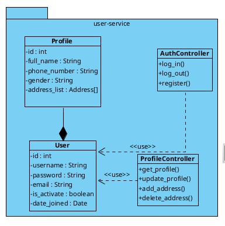

Hình 2.6: Sơ đồ lớp thiết kế User Service

### 2.3.2
Data Model

Dưới đây là sơ đồ Data Model (Physical Schema) của User Service:

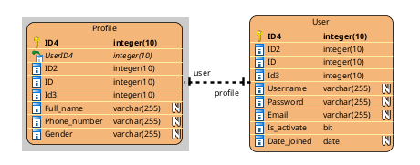

Hình 2.7: Sơ đồ Data Model User Service

### 2.3.3
Django Model

Hệ thống sử dụng các trường dữ liệu tiêu chuẩn kết hợp với các quan hệOne-to-Many
cho sổ địa chỉ(Address Book).

---

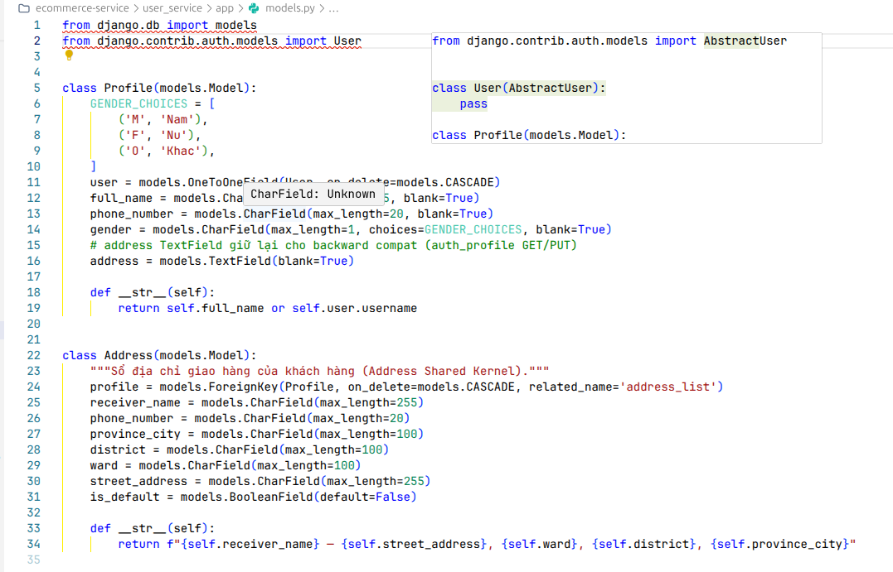

Hình 2.8: Cấu trúc mã nguồn Model của User Service

## 2.4
Staff Service

Staff Service xửlý các tác vụquản trị, quản lý nhân sự vận hành và phân quyền truy
cập dựa trên vai trò (RBAC - Role Based Access Control).

### 2.4.1
Sơ đồ lớp thiết kế

Dưới đây là sơ đồ lớp chi tiết của Staff Service:

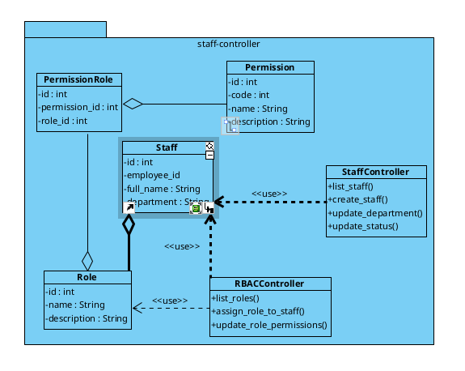

Hình 2.9: Sơ đồ lớp thiết kế Staff Service

---

### 2.4.2
Data Model

Dưới đây là sơ đồ Data Model (Physical Schema) của Staff Service:

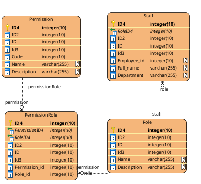

Hình 2.10: Sơ đồ Data Model Staff Service

### 2.4.3
Django Model

Mã nguồn Model của Staff Service tập trung vào việc quản lý các bảng Role, Permission
và Department.

---

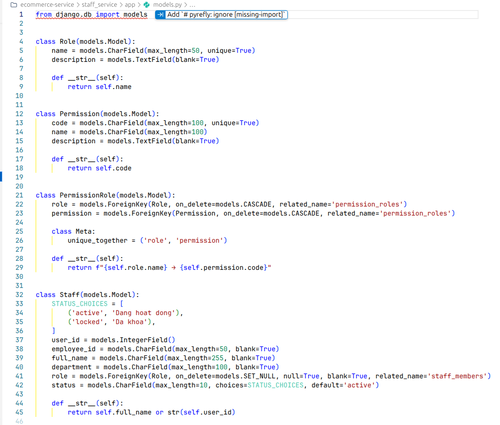

Hình 2.11: Cấu trúc mã nguồn Model của Staff Service

## 2.5
Product Service

Product Service là dịch vụtrung tâm chịu trách nhiệm quản lý toàn bộ dữ liệu về sản
phẩm, danh mục, thương hiệu và các thuộc tính liên quan trong hệ thống. Dịch vụnày
cung cấp khả năng tìm kiếm linh hoạt và quản lý kho hàng cơ bản.

### 2.5.1
Sơ đồ lớp thiết kế

Dưới đây là sơ đồ lớp chi tiết của Product Service, thể hiện mối quan hệ giữa các thực
thể chính như Sản phẩm (Product), Danh mục (Category), Thẻ(Tag) và Hình ảnh (Image).

---

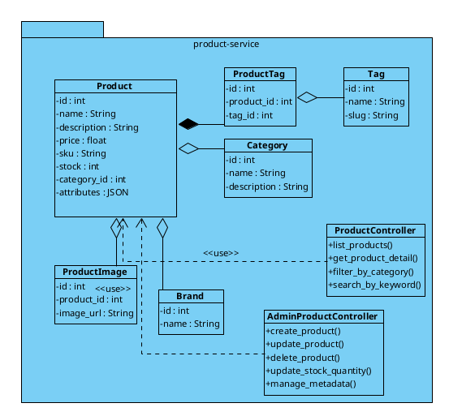

Hình 2.12: Sơ đồ lớp thiết kế Product Service

Sơ đồ lớp bao gồm:

• ProductModel: Thực thể chính lưu trữthông tin sản phẩm (tên, giá, tồn kho) và các
thuộc tính động qua trường JSON.

• CategoryModel: Quản lý cấu trúc danh mục phân cấp (Cha-Con).

• TagModel: Các thẻphân loại sản phẩm.

• ProductImageModel: Quản lý các liên kết hình ảnh của sản phẩm.

### 2.5.2
Data Model

Dưới đây là sơ đồ Data Model (Physical Schema) của Product Service:

---

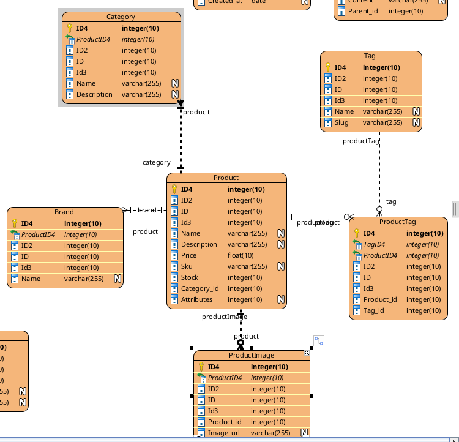

Hình 2.13: Sơ đồ Data Model Product Service

### 2.5.3
Django Model

Hệ thống sử dụng mô hình dữ liệu lai giữa quan hệ(SQL) và phi quan hệ(JSON) để
tối ưu hóa tính linh hoạt. Các thông tin cốt lõi được lưu trữtrong các cột cố định, trong khi
các thuộc tính đặc thù của từng loại sản phẩm được lưu trữtrong trường attributes
kiểu JSON.

---

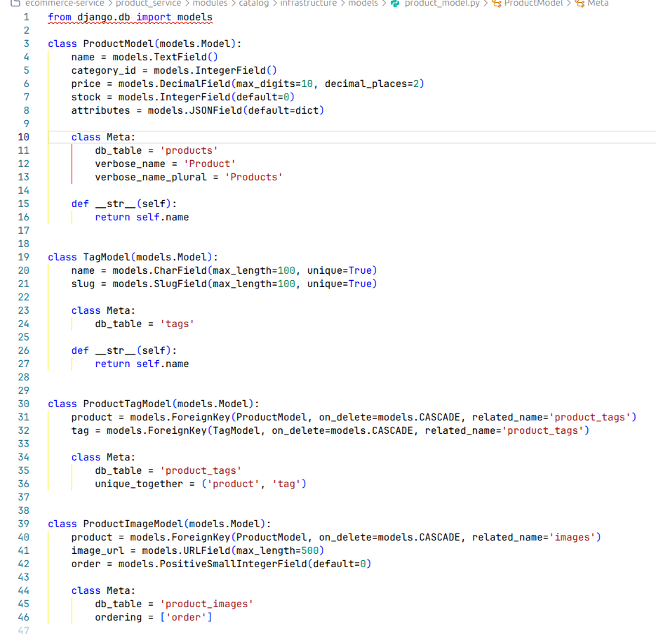

Hình 2.14: Cấu trúc mã nguồn Model của Product Service

### 2.5.4
Thiết kế API

Dưới đây là bảng liệt kê các API chính được cung cấp bởi Product Service:

| Phương thức | Endpoint | Mô tả chức năng |
| :--- | :--- | :--- |
| GET | /products/ | Liệt kê sản phẩm (hỗ trợ lọc, tìm kiếm, sắp xếp) |
| POST | /products/ | Tạo mới một sản phẩm |
| GET | /products/{id}/ | Xem thông tin chi tiết sản phẩm |
| PUT | /products/{id}/ | Cập nhật thông tin sản phẩm và lưu lịch sử |
| DELETE | /products/{id}/ | Xóa sản phẩm khỏi hệ thống |
| PATCH | /products/{id}/stock/ | Cập nhật nhanh số lượng tồn kho |
| GET | /products/{id}/history/ | Truy xuất lịch sử thay đổi của sản phẩm |
| GET/POST | /categories/ | Quản lý danh sách các danh mục sản phẩm |
| GET/POST | /brands/ | Quản lý danh sách các thương hiệu sản phẩm |
| GET/POST | /tags/ | Quản lý danh sách các nhãn gắn vào sản phẩm |

Bảng 2.1: Bảng thiết kế API của Product Service

---

### 2.5.5
Luồng xửlý

Các chức năng chính và luồng xửlý trong Product Service bao gồm:

• Quản lý danh mục và thuộc tính: Định nghĩa cấu trúc ngành hàng và các thuộc
tính đi kèm.

• Quản lý thông tin sản phẩm: Tiếp nhận và xửlý các yêu cầu CRUD (Thêm, Sửa,
Xóa, Truy vấn) sản phẩm.

• Tìm kiếm và Lọc: Xử lý các truy vấn phức tạp dựa trên từkhóa, khoảng giá, danh
mục và sắp xếp.

• Cập nhật tồn kho: Xử lý các yêu cầu điều chỉnh số lượng hàng hóa trong kho.

• Quản lý hình ảnh: Lưu trữ và quản lý thứ tự hiển thị hình ảnh sản phẩm.

• Theo dõi lịch sử: Tự động ghi lại các thay đổi quan trọng đối với thông tin sản phẩm
đểphục vụkiểm tra (audit).

## 2.6
Cart Service

Cart Service chịu trách nhiệm quản lý giỏ hàng tạm thời của người dùng, cho phép
thêm, xóa và cập nhật số lượng sản phẩm trước khi tiến hành đặt hàng.

### 2.6.1
Sơ đồ lớp thiết kế

Dưới đây là sơ đồ lớp chi tiết của Cart Service:

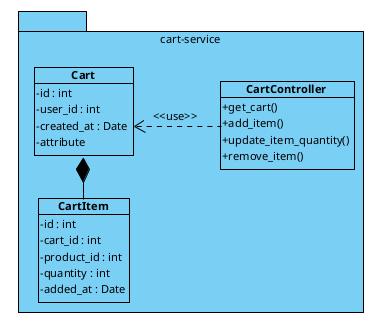

Hình 2.15: Sơ đồ lớp thiết kế Cart Service

---

Sơ đồ lớp bao gồm:

• CartModel: Thực thể chính đại diện cho giỏ hàng của một người dùng.

• CartItemModel: Chi tiết các sản phẩm trong giỏ hàng, bao gồm tham chiếu đến sản
phẩm và số lượng.

### 2.6.2
Data Model

Dưới đây là sơ đồ Data Model (Physical Schema) của Cart Service:

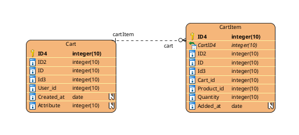

Hình 2.16: Sơ đồ Data Model Cart Service

### 2.6.3
Django Model

Mô hình dữ liệu của Cart Service tập trung vào việc lưu trữ trạng thái mua sắm của
khách hàng.

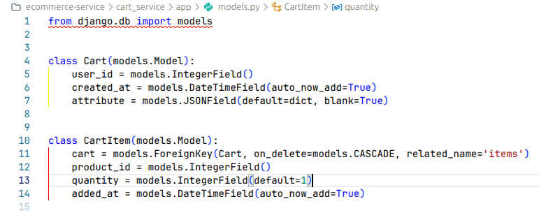

Hình 2.17: Cấu trúc mã nguồn Model của Cart Service

### 2.6.4
Thiết kế API

Dưới đây là bảng liệt kê các API chính được cung cấp bởi Cart Service:

| Phương thức | Endpoint | Mô tả chức năng |
| :--- | :--- | :--- |
| GET | /carts/ | Lấy thông tin giỏ hàng của người dùng hiện tại |
| POST | /carts/ | Khởi tạo hoặc cập nhật giỏ hàng |
| GET | /cartitems/ | Liệt kê toàn bộ sản phẩm trong giỏ hàng |
| POST | /cartitems/ | Thêm sản phẩm mới vào giỏ hàng |
| PUT/PATCH | /cartitems/{id}/ | Cập nhật số lượng của một sản phẩm trong giỏ |
| DELETE | /cartitems/{id}/ | Loại bỏ sản phẩm khỏi giỏ hàng |

Bảng 2.2: Bảng thiết kế API của Cart Service

### 2.6.5
Luồng xửlý

Các chức năng chính và luồng xửlý trong Cart Service bao gồm:

• Quản lý giỏ hàng: Tự động khởi tạo giỏ hàng khi người dùng thêm sản phẩm đầu
tiên.

• Đồng bộ số lượng: Kiểm tra và cập nhật số lượng mua dựa trên yêu cầu của khách

hàng.

• Dọn dẹp giỏ hàng: Xử lý việc làm trống giỏ hàng sau khi đơn hàng đã được tạo
thành công.

## 2.7
Order Service

Order Service là dịch vụquan trọng xửlý quy trình đặt hàng, tính toán tổng giá trịđơn
hàng và quản lý vòng đời của đơn hàng từkhi khởi tạo đến khi hoàn tất.

### 2.7.1
Sơ đồ lớp thiết kế

Dưới đây là sơ đồ lớp chi tiết của Order Service:

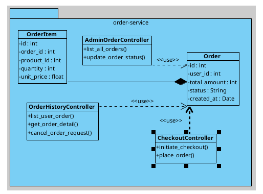

Hình 2.18: Sơ đồ lớp thiết kế Order Service

---

Sơ đồ lớp bao gồm:

• OrderModel: Lưu trữthông tin tổng quát của đơn hàng (trạng thái, tổng tiền, ngày
tạo).

• OrderItemModel: Lưu trữthông tin chi tiết từng sản phẩm trong đơn hàng tại thời
điểm mua (giá chốt, số lượng).

### 2.7.2
Data Model

Dưới đây là sơ đồ Data Model (Physical Schema) của Order Service:

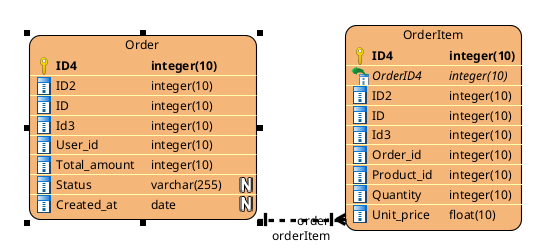

Hình 2.19: Sơ đồ Data Model Order Service

### 2.7.3
Django Model

Mô hình dữ liệu của Order Service được thiết kế đểđảm bảo tính toàn vẹn của dữ liệu
giao dịch.

---

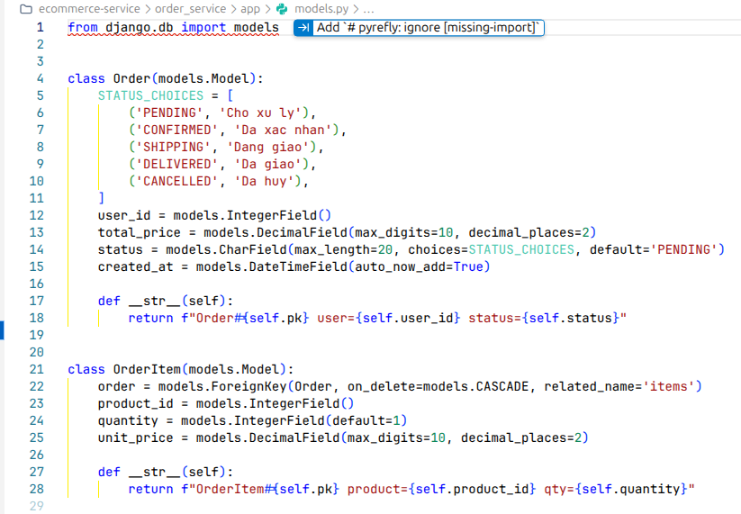

Hình 2.20: Cấu trúc mã nguồn Model của Order Service

### 2.7.4
Thiết kế API

Dưới đây là bảng liệt kê các API chính được cung cấp bởi Order Service:

| Phương thức | Endpoint | Mô tả chức năng |
| :--- | :--- | :--- |
| POST | /orders/ | Thực hiện Checkout và tạo đơn hàng mới |
| GET | /orders/ | Xem lịch sử danh sách đơn hàng của người dùng |
| GET | /orders/{id}/ | Xem chi tiết trạng thái và các mục của một đơn hàng |
| POST | /orders/{id}/cancel/ | Gửi yêu cầu hủy đơn hàng |
| GET | /orderitems/ | Truy xuất chi tiết các mặt hàng trong đơn hàng |

Bảng 2.3: Bảng thiết kế API của Order Service

### 2.7.5
Luồng xửlý

Các chức năng chính và luồng xửlý trong Order Service bao gồm:

• Quy trình Checkout: Chuyển đổi dữ liệu từCart Service sang Order Service và xác
thực tồn kho.

• Quản lý trạng thái: Cập nhật trạng thái đơn hàng (PENDING, CONFIRMED,

SHIPPING, DELIVERED).

• Xử lý hủy đơn: Thực hiện các nghiệp vụhoàn trả tồn kho khi đơn hàng bị hủy.

---

## 2.8
Payment Service

Payment Service chịu trách nhiệm tích hợp các cổng thanh toán và quản lý các giao
dịch tài chính của hệ thống.

### 2.8.1
Sơ đồ lớp thiết kế

Dưới đây là sơ đồ lớp chi tiết của Payment Service:

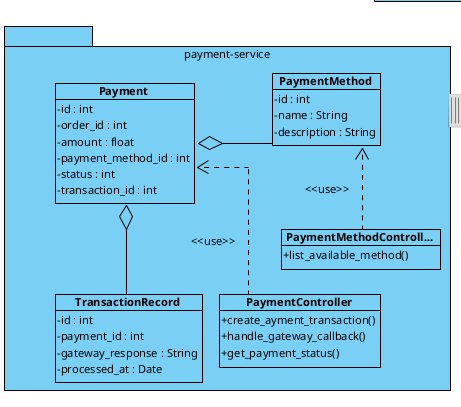

Hình 2.21: Sơ đồ lớp thiết kế Payment Service

Sơ đồ lớp bao gồm:

• PaymentModel: Thông tin thanh toán liên kết với đơn hàng.

• PaymentMethodModel:
Danh
sách
các
phương
thức
hỗ
trợ
(COD,
BANK_TRANSFER, ...).

• TransactionRecordModel: Nhật ký chi tiết các phản hồi từcổng thanh toán.

### 2.8.2
Data Model

Dưới đây là sơ đồ Data Model (Physical Schema) của Payment Service:

---

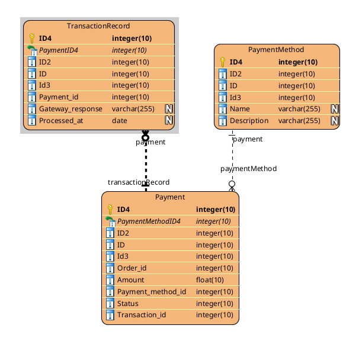

Hình 2.22: Sơ đồ Data Model Payment Service

### 2.8.3
Django Model

Mô hình dữ liệu của Payment Service tập trung vào tính bảo mật và khả năng đối soát.

---

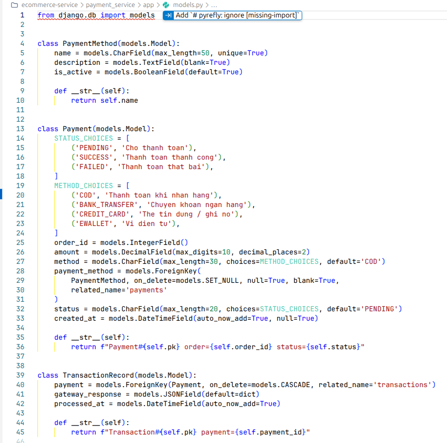

Hình 2.23: Cấu trúc mã nguồn Model của Payment Service

### 2.8.4
Thiết kế API

Dưới đây là bảng liệt kê các API chính được cung cấp bởi Payment Service:

| Phương thức | Endpoint | Mô tả chức năng |
| :--- | :--- | :--- |
| GET | /payment-methods/ | Lấy danh sách các phương thức thanh toán khả dụng |
| POST | /payments/ | Khởi tạo một giao dịch thanh toán mới |
| GET | /payments/{id}/ | Kiểm tra trạng thái của một giao dịch |
| POST | /payments/{id}/callback/ | Tiếp nhận phản hồi từ cổng thanh toán bên ngoài |

Bảng 2.4: Bảng thiết kế API của Payment Service

### 2.8.5
Luồng xửlý

Các chức năng chính và luồng xửlý trong Payment Service bao gồm:

• Khởi tạo giao dịch: Tạo yêu cầu thanh toán và chuyển hướng đến cổng thanh toán
tương ứng.

---

• Xử lý Callback: Xác thực chữ ký số và cập nhật kết quảgiao dịch vào hệ thống.

• Đối soát giao dịch: Ghi lại toàn bộ lịch sửtương tác với cổng thanh toán đểphục
vụkiểm toán.

## 2.9
Shipping Service

Shipping Service quản lý việc giao hàng, theo dõi lộ trình và tích hợp với các đơn vị
vận chuyển đối tác.

### 2.9.1
Sơ đồ lớp thiết kế

Dưới đây là sơ đồ lớp chi tiết của Shipping Service:

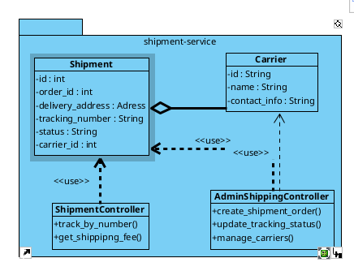

Hình 2.24: Sơ đồ lớp thiết kế Shipping Service

Sơ đồ lớp bao gồm:

• ShipmentModel: Thông tin vận chuyển cho từng đơn hàng (địa chỉ, mã vận đơn,
trạng thái).

• CarrierModel: Thông tin về các đối tác vận chuyển.

### 2.9.2
Data Model

Dưới đây là sơ đồ Data Model (Physical Schema) của Shipping Service:

---

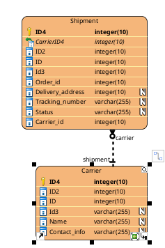

Hình 2.25: Sơ đồ Data Model Shipping Service

### 2.9.3
Django Model

Mô hình dữ liệu của Shipping Service được thiết kế đểtheo dõi sát sao hành trình của
kiện hàng.

---

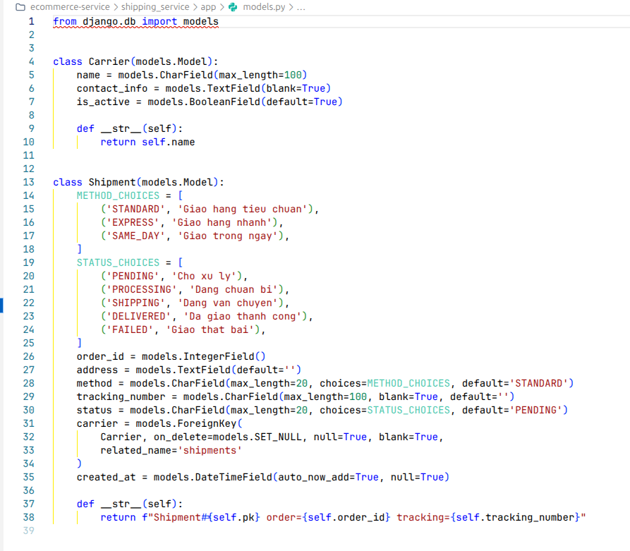

Hình 2.26: Cấu trúc mã nguồn Model của Shipping Service

### 2.9.4
Thiết kế API

Dưới đây là bảng liệt kê các API chính được cung cấp bởi Shipping Service:

| Phương thức | Endpoint | Mô tả chức năng |
| :--- | :--- | :--- |
| GET | /shipments/track/ | Tra cứu lộ trình kiện hàng qua mã vận đơn |
| GET | /shipments/fee/ | Tính toán phí vận chuyển dự kiến |
| POST | /shipments/ | Tạo yêu cầu vận chuyển mới (Admin) |
| GET | /carriers/ | Lấy danh sách các đơn vị vận chuyển |

Bảng 2.5: Bảng thiết kế API của Shipping Service

### 2.9.5
Luồng xửlý

Các chức năng chính và luồng xửlý trong Shipping Service bao gồm:

• Tính phí vận chuyển: Dựa trên khoảng cách, khối lượng và phương thức vận
chuyển.

• Theo dõi vận đơn: Cập nhật liên tục trạng thái từđơn vị vận chuyển đến người
dùng.

---

• Điều phối vận chuyển: Tự động lựa chọn carrier phù hợp nhất theo cấu hình hệ
thống.

## 2.10
Comment Service

Comment Service quản lý các tương tác của người dùng bao gồm đánh giá sản phẩm,
bình luận và các phản hồi thảo luận.

### 2.10.1
Sơ đồ lớp thiết kế

Dưới đây là sơ đồ lớp chi tiết của Comment Service:

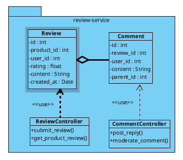

Hình 2.27: Sơ đồ lớp thiết kế Comment Service

Sơ đồ lớp bao gồm:

• ReviewModel: Lưu trữ đánh giá sản phẩm kèm số sao từkhách hàng.

• CommentModel: Lưu trữ các bình luận và phản hồi theo dạng phân cấp (threaded
comments).

### 2.10.2
Data Model

Dưới đây là sơ đồ Data Model (Physical Schema) của Comment Service:

---

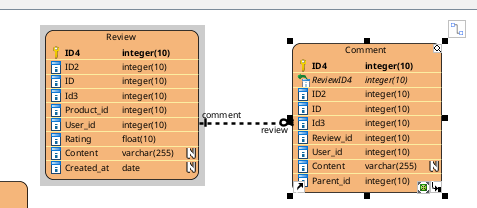

Hình 2.28: Sơ đồ Data Model Comment Service

### 2.10.3
Django Model

Mô hình dữ liệu của Comment Service hỗ trợcác cấu trúc tương tác đa cấp.

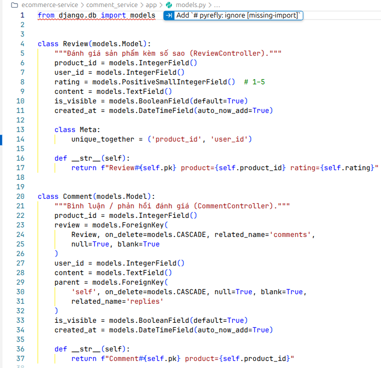

Hình 2.29: Cấu trúc mã nguồn Model của Comment Service

---

### 2.10.4
Thiết kế API

Dưới đây là bảng liệt kê các API chính được cung cấp bởi Comment Service:

| Phương thức | Endpoint | Mô tả chức năng |
| :--- | :--- | :--- |
| POST | /reviews/ | Gửi đánh giá và số sao cho sản phẩm |
| GET | /reviews/ | Xem danh sách đánh giá của sản phẩm |
| POST | /reviews/{id}/moderate/ | Kiểm duyệt nội dung đánh giá (Ẩn/Hiện) |
| POST | /comments/ | Gửi bình luận hoặc phản hồi |
| POST | /comments/{id}/moderate/ | Kiểm duyệt nội dung bình luận |

Bảng 2.6: Bảng thiết kế API của Comment Service

### 2.10.5
Luồng xửlý

Các chức năng chính và luồng xửlý trong Comment Service bao gồm:

• Quản lý tương tác: Xử lý các quy tắc gửi bài và ngăn chặn spam cơ bản.

• Cấu trúc phân cấp: Tổ chức các phản hồi theo dạng cây đểngười dùng dễtheo dõi.

• Kiểm duyệt nội dung: Cho phép nhân viên quản trị ẩn các nội dung không phù hợp.

## 2.11
Luồng hệ thống tổng thể

Hệ thống E-Commerce Microservices vận hành dựa trên sự phối hợp chặt chia sẻ giữa

các dịch vụthông qua API Gateway. Dưới đây là các luồng nghiệp vụcốt lõi thể hiện sự
tương tác liên dịch vụ:

### 2.11.1
Luồng xem sản phẩm và Thêm vào giỏ hàng (Product View & Cart Flow)

Hành trình của khách hàng bắt đầu từviệc khám phá sản phẩm và đưa vào giỏ hàng:

• Xem chi tiết: Khi khách hàng truy cập trang sản phẩm, Gateway gọi Product Service
đểlấy thông tin kỹ thuật và Comment Service đểlấy các đánh giá.

• Ghi nhận hành vi: Một sự kiện ”view”được gửi bất đồng bộsang AI Service để
phục vụthuật toán gợi ý.

• Thêm vào giỏ: Khi khách hàng nhấn ”Thêm vào giỏ”, Gateway sẽtương tác với Cart
Service đểcập nhật trạng thái giỏ hàng của người dùng.

---

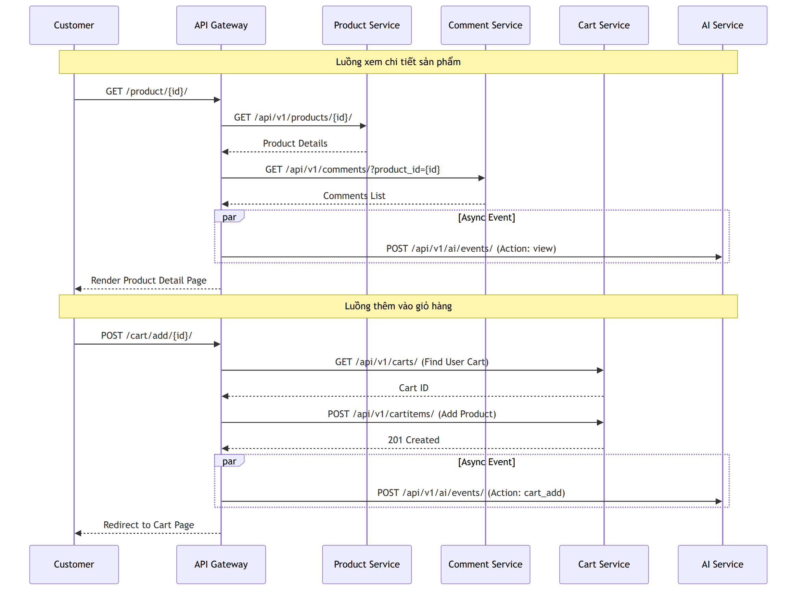

Hình 2.30: Sơ đồ tuần tựluồng xem sản phẩm và thêm vào giỏ hàng

### 2.11.2
Luồng mua sắm và Thanh toán (Purchase & Checkout Flow)

Đây là luồng quan trọng nhất, kết hợp dữ liệu từnhiều service đểhoàn tất đơn hàng.

• Khởi tạo: Khách hàng gửi yêu cầu checkout từAPI Gateway.

• Điều phối: Gateway gọi Order Service đểtạo đơn hàng, sau đó gọi Payment Service
đểkhởi tạo giao dịch và Shipping Service đểtạo vận đơn.

• Hoàn tất: Thông tin được trả về cho khách hàng và sự kiện checkout được gửi sang
AI Service đểphân tích.

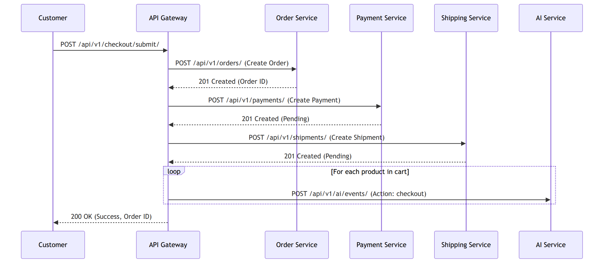

Hình 2.31: Sơ đồ tuần tựluồng mua sắm và thanh toán

---

### 2.11.3
Hệ thống tư vấn thông minh (AI Chatbot Flow)

Luồng này thể hiện khả năng tích hợp RAG (Retrieval-Augmented Generation) đểhỗ
trợ khách hàng.

• Truy vấn: Khách hàng đặt câu hỏi về sản phẩm qua giao diện chat.

• Xử lý AI: AI Service tìm kiếm sản phẩm liên quan trong cơ sởdữ liệu tri thức và
tạo câu trả lời kèm lý giải (reasoning).

• Làm giàu dữ liệu: Gateway nhận danh sách ID sản phẩm từAI, gọi Product Service
đểlấy thông tin chi tiết (ảnh, giá) trước khi hiển thịcho người dùng.

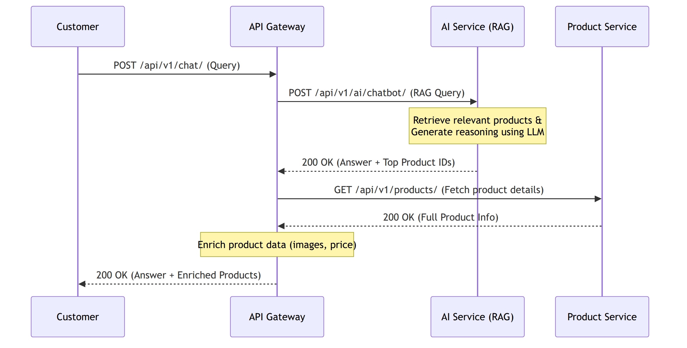

Hình 2.32: Sơ đồ tuần tựluồng tư vấn AI

### 2.11.4
Theo dõi hành vi và Gợi ý (Behavior Tracking Flow)

Đểtối ưu hóa gợi ý, hệ thống theo dõi mọi tương tác của người dùng một cách bất
đồng bộ.

• Bắt sự kiện: Các hành động View, Click, Add-to-cart được Gateway ghi nhận.

• Xử lý nền: Gateway sử dụng Multi-threading đểgửi dữ liệu hành vi sang AI Service
mà không làm gián đoạn trải nghiệm người dùng (Fire-and-forget).

---

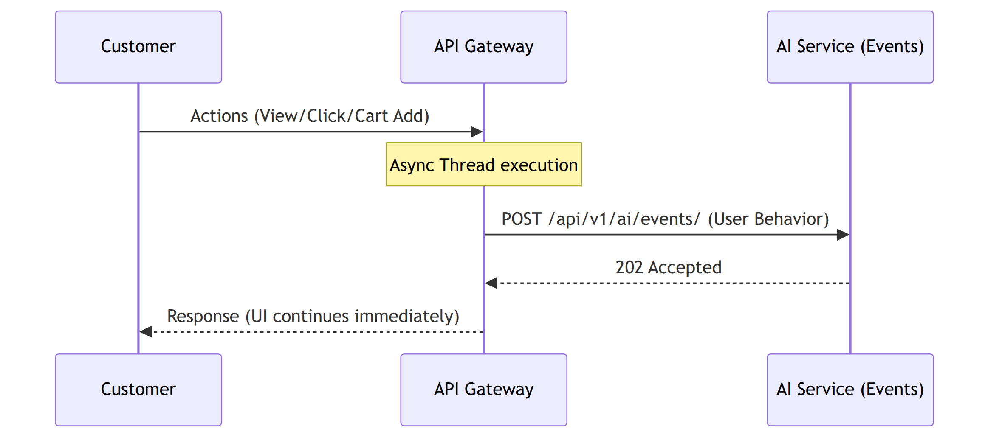

Hình 2.33: Sơ đồ tuần tựluồng theo dõi hành vi

### 2.11.5
Quản lý Đánh giá và Bình luận (Product Review Flow)

• Lưu trữ: Bình luận được gửi đến Comment Service đểlưu trữ và phân cấp.

• Phản hồi: Sau khi lưu thành công, một sự kiện ’review’ được gửi sang AI Service
đểcập nhật hồ sơ sở thích của người dùng.

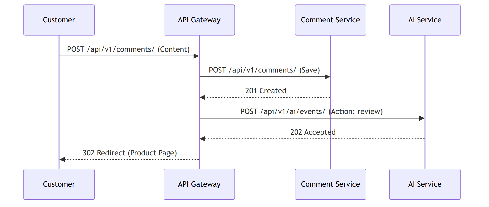

Hình 2.34: Sơ đồ tuần tựluồng đánh giá sản phẩm

## 2.12
Các hệ quản trịcơ sởdữ liệu được sử dụng

Trong kiến trúc Microservices của hệ thống, chúng tôi áp dụng chiến lược Polyglot
Persistence - sử dụng nhiều loại cơ sởdữ liệu khác nhau tùy theo đặc thù của từng service
đểtối ưu hóa hiệu năng và khả năng mở rộng.

### 2.12.1
MySQL

MySQL được lựa chọn làm cơ sởdữ liệu cho các service như User Service, Payment
Service và Shipping Service.

• Lý do sử dụng: Đây là những service có cấu trúc dữ liệu quan hệ chặt chẽ, yêu cầu
tính ổn định cao và các giao dịch tài chính (ACID) tiêu chuẩn. MySQL cung cấp
hiệu năng đọc/ghi cực tốt cho các thao tác OLTP (Online Transactional Processing)

---

thông thường và có cộng đồng hỗ trợlớn, dễ dàng triển khai trên các môi trường
cloud.

• Đặc điểm: Sử sử Storage Engine InnoDB đểđảm bảo an toàn dữ liệu qua cơ chế

khóa dòng (row-level locking) và hỗ trợkhóa ngoại (foreign keys) mạnh mẽ.

### 2.12.2
PostgreSQL

PostgreSQL được sử dụng cho các service trọng yếu như Product Service, Order
Service, Cart Service và AI Service.

• Lý do sử dụng:

– Đối với Product Service: PostgreSQL có khả năng xửlý kiểu dữ liệu JSONB
vượt trội. Điều này cho phép lưu trữ các thuộc tính sản phẩm động (như cấu
hình máy tính, thông số quần áo) trong cùng một cột mà vẫn có thể đánh chỉ
mục (GIN Index) đểtìm kiếm nhanh chóng.

– Đối với Order Service: Yêu cầu tính toàn vẹn dữ liệu cực kỳ khắt khe và các
câu lệnh truy vấn phức tạp đểthống kê báo cáo.

– Đối với AI Service: PostgreSQL hỗ trợcác extension mở rộng (như pgvector)
giúp lưu trữ và truy vấn vector phục vụcho RAG trong tương lai.

### 2.12.3
So sánh MySQL và PostgreSQL

Dưới đây là bảng so sánh các đặc tính kỹ thuật chính dẫn đến quyết định lựa chọn trong
hệ thống:

Đặc tính
MySQL
PostgreSQL
Kiểu dữ liệu
Hỗ trợ các kiểu cơ bản, hỗ trợ
JSON hạn chế hơn.

Hỗ trợ cực mạnh JSONB, mảng
(Array), và kiểu tùy chỉnh.
Hiệu năng
Tối ưu cho các truy vấn đọc đơn
giản, tốc độcao.

Tối ưu cho các truy vấn phức tạp,
tính toán nhiều và xửlý đồng thời.
Khảnăng mở rộng
Chủ yếu mở rộng theo chiều dọc
hoặc Master-Slave.

Hỗ trợ tốt hơn cho các tính
năng nâng cao, phân vùng dữ liệu
(Partitioning).
Tính năng ACID
Tuân thủ tốt qua InnoDB.
Tuân thủ cực kỳ khắt khe, mặc
định an toàn dữ liệu cao hơn.
Ứng dụng trong dự án
User, Payment, Shipping, Staff
Service.

Product, Order, Cart, Comment,
AI Service.

Bảng 2.7: So sánh MySQL và PostgreSQL trong hệ thống

## 2.13
Kết luận

---
