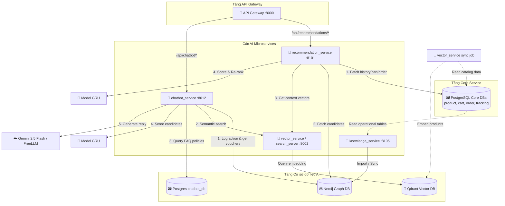
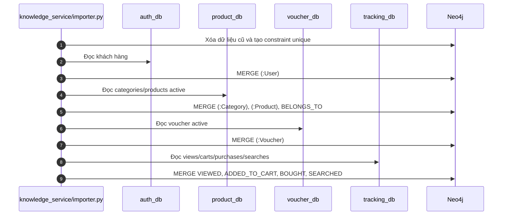
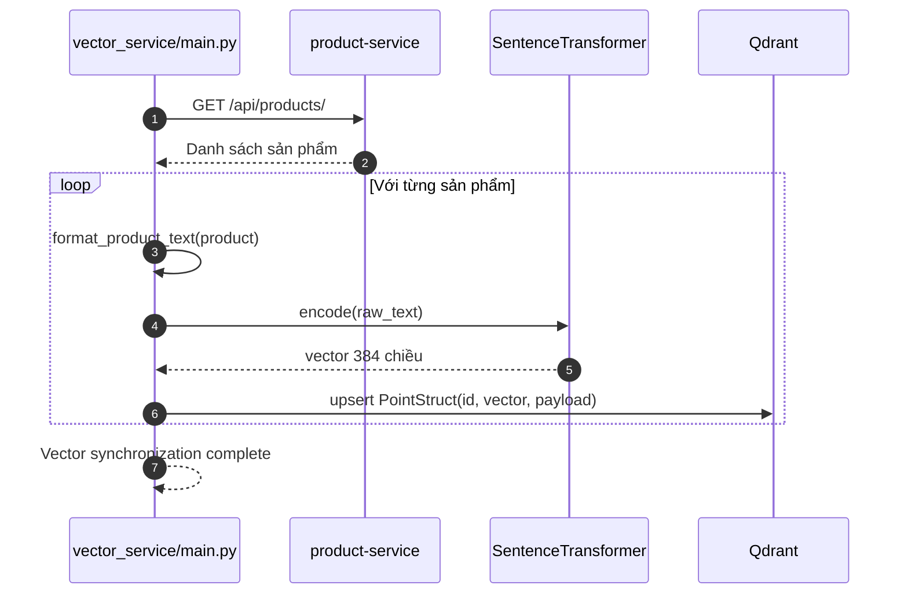
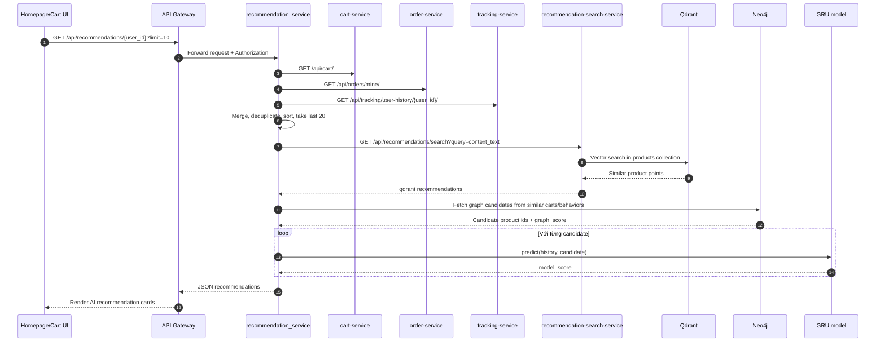
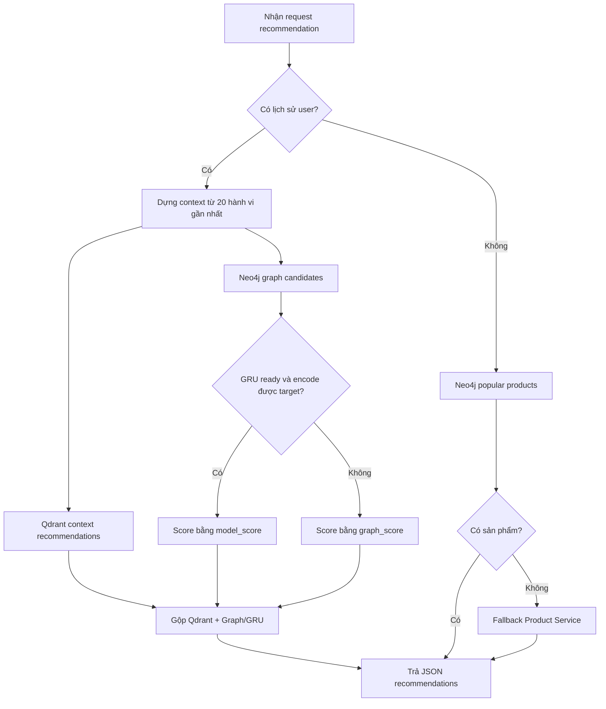
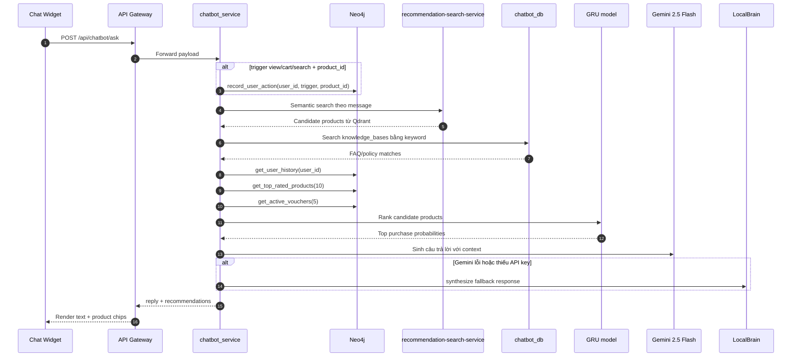

# CHƯƠNG 3. THIẾT KẾ PHÂN HỆ AI SERVICE VÀ CHATBOT RAG

## 3.1 Mục tiêu

Phân hệ AI Service trong hệ thống **TruongShop AI-Ecom** được xây dựng nhằm cá nhân hóa trải nghiệm khách hàng và tối ưu hóa tỷ lệ chuyển đổi đơn hàng thông qua việc tích hợp sâu các công nghệ trí tuệ nhân tạo hiện đại. Mục tiêu cụ thể của phân hệ bao gồm ba khía cạnh chính dưới đây:

### 3.1.1 Phân tích hành vi người dùng thời gian thực
Hệ thống hướng tới việc theo dõi, thu thập và phân tích chuỗi hoạt động tương tác tuần tự của khách hàng trên giao diện web.
*   **Hành vi theo dõi:** Ghi nhận các sự kiện xem sản phẩm (`view`/`pv`), thêm sản phẩm vào giỏ hàng (`cart`/`add_to_cart`), mua hàng thành công (`buy`/`purchase`), và truy vấn tìm kiếm (`search`).
*   **Ý nghĩa:** Xây dựng hồ sơ hành vi động (Dynamic User Profile) theo thời gian thực làm dữ liệu đầu vào cho các thuật toán học máy dự đoán ý định mua sắm tiếp theo.

### 3.1.2 Khai phá quan hệ thực thể và tìm kiếm ngữ nghĩa
*   **Đồ thị tri thức (Knowledge Graph):** Biểu diễn mối quan hệ đa chiều giữa các thực thể cốt lõi của hệ sinh thái thương mại điện tử bao gồm Người dùng (`User`), Sản phẩm (`Product`), Danh mục (`Category`), Ưu đãi (`Voucher`), và Lịch sử truy vấn (`Search`). Khai thác các liên kết tương tác để giải quyết bài toán gợi ý cộng tác (Collaborative Filtering) và giải quyết vấn đề khởi động lạnh (Cold-start) cho người dùng mới.
*   **Tìm kiếm ngữ nghĩa (Semantic Search):** Chuyển đổi dữ liệu thuộc tính của sản phẩm thành các vector nhúng ngữ nghĩa (embedding vectors) để thực hiện tìm kiếm tương đồng ngữ cảnh, cho phép khách hàng tìm thấy sản phẩm mong muốn ngay cả khi từ khóa nhập vào không khớp hoàn toàn với tên sản phẩm.

### 3.1.3 Trợ lý ảo tư vấn thông minh (RAG Chatbot)
*   Xây dựng một chatbot tư vấn hỗ trợ khách hàng theo mô hình Truy xuất tăng cường (RAG - Retrieval-Augmented Generation).
*   Chatbot có mục tiêu tự động nhận diện ý định mua sắm (buying intent) trong hội thoại để kích hoạt luồng gợi ý sản phẩm, truy xuất các chính sách cửa hàng/FAQ phù hợp, tích hợp các voucher khuyến mãi hiện có và sinh câu trả lời tự nhiên bằng tiếng Việt thông qua mô hình ngôn ngữ lớn (Gemini API) hoặc bộ sinh luật dự phòng cục bộ.

### 3.1.4 Kết quả đầu ra (Outputs) của hệ thống
Hệ thống AI Service hướng tới việc cung cấp hai loại đầu ra tiêu chuẩn:
*   **Danh sách sản phẩm đề xuất (Recommendation List):** Được sắp xếp và chấm điểm tối ưu dựa trên sự kết hợp giữa gợi ý ngữ cảnh ngữ nghĩa từ Qdrant, ứng viên liên quan từ đồ thị Neo4j, và điểm dự đoán xác suất mua hàng từ mô hình Sequence học sâu GRU.
*   **Phản hồi của Chatbot hỗ trợ:** Trả về câu trả lời tự nhiên bằng tiếng Việt kèm theo tối đa 3 sản phẩm đính kèm được mô hình AI xếp hạng cao nhất để hiển thị trực tiếp trên giao diện chat.

---

## 3.2 Kiến trúc AI service

AI Service được thiết kế dưới dạng các microservice độc lập chạy song song, giao tiếp với nhau qua giao thức REST API (thông qua API Gateway hoặc gọi trực tiếp trong mạng nội bộ Docker) và kết nối với các cơ sở dữ liệu chuyên biệt.

### 3.2.1 Sơ đồ kiến trúc tổng thể

Mô hình hệ thống AI Service được tổ chức thành 4 dịch vụ thành phần chính liên kết chặt chẽ với nhau và với cơ sở dữ liệu nghiệp vụ:



### 3.2.2 Cấu trúc đầu vào và đầu ra (Input/Output API Contract)
*   **Đầu vào (Input):**
    *   `user_id`: Định danh của khách hàng truy cập.
    *   `message`: Tin nhắn văn bản hội thoại của người dùng (trong Chatbot).
    *   `trigger`: Sự kiện kích hoạt hành vi nghiệp vụ (`view`, `cart`, `search`).
    *   `query`: Từ khóa tìm kiếm thô của người dùng.
*   **Đầu ra (Output):**
    *   Đối với Recommendation API: Trả về cấu trúc JSON chứa danh sách sản phẩm gợi ý cùng với các điểm số (`score`, `model_score`, `graph_score`) và lý do đề xuất (`reason`).
    *   Đối với Chatbot API: Trả về câu trả lời bằng văn bản tự nhiên (`reply`) cùng danh sách các sản phẩm đính kèm đề xuất (`recommendations`).

### 3.2.3 Các thành phần xử lý chính (Core Processing Components)

#### 1. Dịch vụ gợi ý cá nhân hóa (`recommendation_service`)
*   **Công nghệ & Cổng:** FastAPI chạy trên port internal `8001` (port host `8101`).
*   **Vai trò:** Tiếp nhận các yêu cầu gợi ý cá nhân hóa từ API Gateway. Thực hiện thu thập lịch sử hành vi của người dùng từ các dịch vụ core (Cart, Order, Tracking), truy vấn lấy danh sách sản phẩm phổ biến và ứng viên liên quan từ đồ thị Neo4j, đồng thời phối hợp với Vector Search để lấy gợi ý ngữ cảnh ngữ nghĩa. Sau đó, nạp mô hình GRU học sâu để chấm điểm xác suất mua hàng thời gian thực và thực hiện tái xếp hạng (re-ranking) các sản phẩm trước khi trả về Client.

#### 2. Dịch vụ Chatbot tư vấn (`chatbot_service`)
*   **Công nghệ & Cổng:** FastAPI chạy trên port internal `8000` (port host `8012`).
*   **Vai trò:** Quản lý luồng xử lý RAG Chatbot. Nhận tin nhắn chat của người dùng, thực hiện ghi nhận vết tương tác lên Neo4j, gọi tìm kiếm vector ngữ nghĩa và tìm kiếm FAQ PostgreSQL song song để làm giàu ngữ cảnh. Đồng thời, sử dụng mô hình học sâu GRU để chọn ra top 3 sản phẩm đề xuất, kết hợp với voucher hoạt động lấy từ đồ thị Neo4j để đưa vào prompt sinh câu trả lời tự nhiên qua Gemini API (hoặc fallback sang LocalBrain).

#### 3. Dịch vụ đồng bộ và tìm kiếm vector (`vector_service`)
*   **Công nghệ & Cổng:** Python và thư viện `sentence-transformers` (chạy search server trên port internal `8002`).
*   **Vai trò:** Chứa job đồng bộ định kỳ quét dữ liệu sản phẩm từ Product Service, chuyển đổi các trường văn bản thuộc tính thành đoạn mô tả thô duy nhất và tạo vector nhúng 384 chiều bằng mô hình `all-MiniLM-L6-v2` để lưu vào Qdrant. Expose dịch vụ `search_server.py` để tiếp nhận các truy vấn tìm kiếm ngữ nghĩa thời gian thực cho hệ thống gợi ý và chatbot.

#### 4. Dịch vụ Đồ thị Tri thức (`knowledge_service`)
*   **Công nghệ & Cổng:** FastAPI chạy trên port internal `8005` (port host `8105`).
*   **Vai trò:** Chịu trách nhiệm đồng bộ hóa dữ liệu (ETL) từ các cơ sở dữ liệu quan hệ nghiệp vụ PostgreSQL sang đồ thị tri thức Neo4j thông qua script `importer.py` và `sync_operational_db.py`. Expose các API truy vấn luật đồ thị ("People also bought") và tìm Shortest Path nối giữa người dùng và sản phẩm để giải thích lý do gợi ý.

#### 5. Mô hình Sequence Model (GRU Model)
*   **Công nghệ:** TensorFlow/Keras.
*   **Vai trò:** Thay thế cho kiến trúc RNN/LSTM/BiLSTM + Attention cũ, mô hình hiện tại sử dụng mạng nơ-ron hồi quy GRU (Gated Recurrent Unit) với 4 luồng đầu vào (Behavior sequence, Item sequence, Category sequence, và Target item) để dự đoán chính xác xác suất khách hàng sẽ thực hiện hành vi mua hàng đối với một sản phẩm mục tiêu cụ thể dựa trên chuỗi 20 hành động gần nhất.

---

## 3.3 Thu thập dữ liệu

*(Người dùng tự viết)*

### 3.3.1 User Behavior Data

*(Người dùng tự viết)*

### 3.3.2 Ví dụ dataset (data_user500.csv)

*(Người dùng tự viết)*

---

## 3.4 Mô hình Sequence Modeling (GRU)

*(Người dùng tự viết)*

### 3.4.1 Tiền xử lý và Xây dựng chuỗi dữ liệu

*(Người dùng tự viết)*

### 3.4.2 Kiến trúc Mô hình (GRU Model)

*(Người dùng tự viết)*

### 3.4.3 Quá trình Huấn luyện (Training)

*(Người dùng tự viết)*

### 3.4.4 Đánh giá và Phân tích kết quả

*(Người dùng tự viết)*

---

## 3.5 Knowledge Graph với Neo4j

Từ phiên bản code mới, Knowledge Graph không còn chỉ là phần minh họa tĩnh mà đã trở thành tầng dữ liệu dùng chung cho cả `recommendation_service` và `chatbot_service`. Neo4j được dùng để lưu quan hệ giữa người dùng, sản phẩm, danh mục, voucher và lịch sử tương tác. Các quan hệ này hỗ trợ ba nhóm chức năng chính:

*   Truy vấn ứng viên gợi ý theo hành vi cộng đồng, ví dụ những khách hàng có giỏ hàng tương tự đã mua/xem/thêm gì.
*   Lưu vết tương tác mới phát sinh từ chatbot, ví dụ người dùng vừa xem hoặc thêm một sản phẩm vào giỏ.
*   Cung cấp ngữ cảnh cho chatbot như lịch sử người dùng, sản phẩm phổ biến/top rating và voucher đang hoạt động.

Trong kiến trúc hiện tại, dữ liệu graph được đồng bộ từ các database nghiệp vụ bằng `knowledge_service/importer.py`. Service `knowledge_service/main.py` expose một số API graph cơ bản, còn các service AI có thể kết nối trực tiếp Neo4j bằng Bolt trong mạng Docker để truy vấn nhanh.

### 3.5.1 Mô hình đồ thị

Các node chính trong đồ thị:

| Node | Nguồn dữ liệu | Thuộc tính tiêu biểu | Vai trò |
|---|---|---|---|
| `User` | `auth_db` và tracking log | `id`, `email`, `full_name` | Đại diện khách hàng, là điểm bắt đầu của lịch sử hành vi |
| `Product` | `product_db.products` | `id`, `name`, `description`, `price`, `image_url`, `product_type`, `attributes`, `is_active` | Sản phẩm được tìm kiếm, gợi ý và tư vấn |
| `Category` | `product_db.categories` | `id`, `name`, `description`, `icon` | Gom nhóm sản phẩm, hỗ trợ giải thích và tìm theo danh mục |
| `Voucher` | `voucher_db.vouchers` | `id`, `code`, `name`, `discount_type`, `discount_value`, `min_order_value`, `is_active` | Cung cấp khuyến mãi cho chatbot |
| `Search` | `tracking_db.search_history` hoặc file CSV | `query` | Lưu truy vấn tìm kiếm của người dùng |

Các quan hệ chính:

| Relationship | Hướng | Ý nghĩa |
|---|---|---|
| `(:Product)-[:BELONGS_TO]->(:Category)` | Product sang Category | Sản phẩm thuộc danh mục nào |
| `(:User)-[:VIEWED]->(:Product)` | User sang Product | Người dùng đã xem sản phẩm |
| `(:User)-[:ADDED_TO_CART]->(:Product)` | User sang Product | Người dùng đã thêm sản phẩm vào giỏ |
| `(:User)-[:BOUGHT]->(:Product)` | User sang Product | Người dùng đã mua sản phẩm |
| `(:User)-[:SEARCHED]->(:Product)` | User sang Product | Người dùng tìm kiếm và đi tới sản phẩm |
| `(:User)-[:SEARCHED]->(:Search)` | User sang Search | Người dùng tìm kiếm bằng câu truy vấn nhưng chưa gắn với sản phẩm cụ thể |

Quy trình đồng bộ dữ liệu graph:



Để đảm bảo truy vấn nhanh và tránh trùng node, importer tạo constraint:

```cypher
CREATE CONSTRAINT user_id IF NOT EXISTS
FOR (u:User) REQUIRE u.id IS UNIQUE;

CREATE CONSTRAINT product_id IF NOT EXISTS
FOR (p:Product) REQUIRE p.id IS UNIQUE;

CREATE CONSTRAINT category_id IF NOT EXISTS
FOR (c:Category) REQUIRE c.id IS UNIQUE;

CREATE CONSTRAINT voucher_id IF NOT EXISTS
FOR (v:Voucher) REQUIRE v.id IS UNIQUE;
```

### 3.5.2 Ví dụ Cypher (Tạo đồ thị)

Ví dụ tạo hoặc cập nhật sản phẩm, danh mục và quan hệ `BELONGS_TO`:

```cypher
MERGE (c:Category {id: $category_id})
SET c.name = $category_name,
    c.description = $category_description,
    c.icon = $category_icon

MERGE (p:Product {id: $product_id})
SET p.name = $name,
    p.description = $description,
    p.price = $price,
    p.image_url = $image_url,
    p.product_type = $product_type,
    p.attributes = $attributes,
    p.is_active = $is_active

WITH p
MATCH (c:Category {id: $category_id})
MERGE (p)-[:BELONGS_TO]->(c);
```

Ví dụ ghi nhận hành vi mua hàng từ `tracking_db.purchase_actions` (với ID cụ thể là `customer_id=1000228`, `product_id=221387` và `timestamp=1781071150`):

```cypher
MERGE (u:User {id: 1000228})
WITH u
MATCH (p:Product {id: 221387})
MERGE (u)-[r:BOUGHT {timestamp: 1781071150}]->(p);
```

Ví dụ chatbot ghi nhận hành vi realtime khi người dùng đang tương tác trên giao diện (với ID cụ thể là `user_id=1000228`, `product_id=221387`):

```cypher
MERGE (u:User {id: 1000228})
WITH u
MATCH (p:Product {id: 221387})
MERGE (u)-[r:ADDED_TO_CART {timestamp: timestamp()}]->(p);
```

### 3.5.3 Truy vấn gợi ý ("People also bought")

`knowledge_service/main.py` vẫn cung cấp API graph cơ bản:

```http
GET /recommendations/1000228
```

Logic Cypher (sử dụng hành vi `VIEWED` vốn có nhiều bản ghi trong cơ sở dữ liệu để kiểm thử, với `uid=1000228`):

```cypher
MATCH (u:User {id: 1000228})-[:VIEWED]->(p:Product)<-[:VIEWED]-(other:User)-[:VIEWED]->(reco:Product)
WHERE NOT (u)-[:VIEWED]->(reco) AND reco <> p
RETURN reco.id as id, count(*) as weight
ORDER BY weight DESC
LIMIT 5;
```

Tuy nhiên, trong code mới, `recommendation_service` dùng graph sâu hơn. Khi người dùng có lịch sử, service lấy các `seed_ids` từ 20 hành vi gần nhất rồi tìm sản phẩm liên quan theo ba nhóm quan hệ:

| Nguồn ứng viên | Quan hệ truy vấn | Trọng số |
|---|---|---|
| `other_users_bought` | Người dùng khác có cùng sản phẩm trong giỏ và đã `BOUGHT` sản phẩm khác | 3.0 |
| `other_users_added_to_cart` | Người dùng khác có cùng sản phẩm trong giỏ và đã `ADDED_TO_CART` sản phẩm khác | 2.0 |
| `other_users_viewed` | Người dùng khác có cùng sản phẩm trong giỏ và đã `VIEWED` sản phẩm khác | 1.0 |

Mẫu truy vấn chính trong `recommendation_service/main.py` (sử dụng hành vi `VIEWED` vốn có nhiều bản ghi trong cơ sở dữ liệu để kiểm thử, với `user_id=1000228`, `seed_ids=[221387, 18309, 116741]`, `excluded_ids=[139496]`, `weight=3.0`, `source='other_users_viewed'`, `limit=10`):

```cypher
MATCH (other:User)-[seed_action:VIEWED]->(seed:Product)
WHERE seed.id IN [221387, 18309, 116741] AND other.id <> 1000228
MATCH (other)-[target:VIEWED]->(p:Product)
WHERE coalesce(p.is_active, true) = true
  AND NOT p.id IN [221387, 18309, 116741]
  AND NOT p.id IN [139496]
  AND (
    seed_action.timestamp IS NULL
    OR target.timestamp IS NULL
    OR toString(target.timestamp) >= toString(seed_action.timestamp)
  )
WITH p, count(DISTINCT other) AS users, count(target) AS interactions
RETURN p.id AS id,
       (users * 3.0 + interactions) AS graph_score,
       'other_users_viewed' AS source,
       users,
       interactions
ORDER BY graph_score DESC, users DESC, p.id ASC
LIMIT 10;
```

Nếu người dùng chưa có đủ lịch sử hoặc graph không trả về ứng viên, hệ thống chuyển sang truy vấn sản phẩm phổ biến (với ID cụ thể là `excluded_ids=[139496]`, `limit=10`):

```cypher
MATCH (p:Product)
WHERE coalesce(p.is_active, true) = true AND NOT p.id IN [139496]
OPTIONAL MATCH (:User)-[b:BOUGHT]->(p)
OPTIONAL MATCH (:User)-[c:ADDED_TO_CART]->(p)
OPTIONAL MATCH (:User)-[v:VIEWED]->(p)
WITH p, count(DISTINCT b) AS buys, count(DISTINCT c) AS carts, count(DISTINCT v) AS views
RETURN p.id AS id,
       (buys * 3.0 + carts * 2.0 + views) AS graph_score,
       'popular' AS source,
       buys, carts, views
ORDER BY graph_score DESC, p.id ASC
LIMIT 10;
```

Như vậy, Neo4j đóng vai trò tầng “candidate generation” và “fallback popularity”, còn GRU và Qdrant đảm nhận phần cá nhân hóa/xếp hạng sâu hơn ở các bước sau.

---

## 3.6 RAG & Vector Semantic Search

Tầng tìm kiếm ngữ nghĩa được tách thành hai phần:

*   `vector_service/main.py`: job đồng bộ sản phẩm sang Qdrant.
*   `vector_service/search_server.py`: HTTP search server phục vụ truy vấn realtime tại `/api/recommendations/search`.

Điểm khác biệt so với bản code cũ là vector không chỉ dùng cho trang tìm kiếm, mà còn được dùng làm “ngữ cảnh sản phẩm” cho recommendation và chatbot. Khi người dùng nhập câu tự nhiên như “áo hoodie cotton giá mềm” hoặc khi hệ thống dựng context từ lịch sử giỏ hàng/mua hàng, Qdrant giúp tìm các sản phẩm tương đồng về ý nghĩa thay vì chỉ khớp từ khóa.

### 3.6.1 Pipeline Vectorization (vector_service)

`vector_service/main.py` thực hiện quá trình indexing như sau:

1.  Gọi `PRODUCT_SERVICE_URL` để lấy toàn bộ danh sách sản phẩm.
2.  Ghép các trường quan trọng thành một đoạn mô tả duy nhất bằng hàm `format_product_text`.
3.  Dùng `SentenceTransformer('all-MiniLM-L6-v2')` để encode đoạn mô tả thành vector 384 chiều.
4.  Tạo collection `products` trong Qdrant nếu chưa tồn tại, sử dụng `Distance.COSINE`.
5.  Upsert từng sản phẩm vào Qdrant với `id` là `product_id`, `vector` là embedding, `payload` là thông tin hiển thị.

Cấu trúc text đưa vào embedding:

```text
Product Name: <name>.
Category: <category>.
Type: <product_type>.
Description: <description>.
Attributes: <key>: <value>, ...
Options: <variant names>.
```

Payload lưu trong Qdrant:

```json
{
  "id": 12,
  "name": "Cotton Hoodie",
  "category": "Fashion",
  "product_type": "clothes",
  "price": 350000,
  "image_url": "https://...",
  "raw_text": "Product Name: Cotton Hoodie. Category: Fashion. ..."
}
```

Sequence đồng bộ vector:



### 3.6.2 Pipeline Context Recommendation (recommendation_service)

Trong endpoint:

```http
GET /api/recommendations/{user_id}?limit=10
```

`recommendation_service` lấy lịch sử người dùng từ ba nguồn:

| Nguồn | Cách gọi | Hành vi sinh ra |
|---|---|---|
| Cart service | `GET /api/cart/` kèm `Authorization` | `cart` |
| Order service | `GET /api/orders/mine/` kèm `Authorization` | `buy` |
| Tracking service | `GET /api/tracking/user-history/{user_id}/` | `pv`, `cart`, `buy` |

Sau đó service gộp, khử trùng lặp theo `(product_id, behavior, timestamp)`, sắp xếp tăng dần theo thời gian và chỉ giữ tối đa 20 hành vi gần nhất. Đây là cùng chiều dữ liệu với mô hình GRU đã huấn luyện ở phần 3.4.

Với phần Qdrant context, lịch sử được chuyển thành đoạn text có trọng số theo hành vi:

| Hành vi | Nhãn text | Số lần nhân bản |
|---|---|---|
| `pv` | `Viewed` | 1 |
| `cart` | `Added to cart` | 2 |
| `buy` | `Purchased` | 3 |

Ví dụ nếu người dùng đã xem áo khoác, thêm quần jeans vào giỏ và từng mua giày sneaker, context có dạng:

```text
Viewed: Product Name: Winter Jacket. Category: Clothes. ...
Added to cart: Product Name: Denim Jeans. Category: Clothes. ...
Added to cart: Product Name: Denim Jeans. Category: Clothes. ...
Purchased: Product Name: Running Sneaker. Category: Shoes. ...
Purchased: Product Name: Running Sneaker. Category: Shoes. ...
Purchased: Product Name: Running Sneaker. Category: Shoes. ...
```

Context này được gửi sang `recommendation-search-service`:

```http
GET /api/recommendations/search?query=<context_text>&limit=10
```

`search_server.py` encode query bằng cùng model `all-MiniLM-L6-v2`, tìm vector gần nhất trong Qdrant và trả về danh sách:

```json
{
  "success": true,
  "query": "...",
  "strategy": "qdrant_semantic_search",
  "recommendations": [
    {
      "id": 21,
      "score": 0.71,
      "payload": {
        "name": "Docker Container Socks",
        "category": "clothes",
        "product_type": "clothes"
      },
      "source": "qdrant",
      "reason": "Semantic vector search via Qdrant"
    }
  ]
}
```

Các sản phẩm đã có trong giỏ hoặc đã mua được đưa vào `excluded_ids` để tránh đề xuất lặp lại.

### 3.6.3 Ví dụ xử lý

Ví dụ người dùng `user_id=5` mở homepage:

1.  API Gateway nhận request `/api/recommendations/5?limit=10`.
2.  Middleware forward sang `recommendation-service:8001`.
3.  Recommendation service lấy cart hiện tại, đơn hàng gần đây và tracking history.
4.  Lịch sử được chuẩn hóa thành các `ProductSignal(product_id, behavior, timestamp, source)`.
5.  Hệ thống dựng `context_text` có trọng số hành vi và gọi Qdrant semantic search.
6.  Neo4j sinh thêm ứng viên theo graph nếu Qdrant chưa đủ hoặc để phục vụ GRU ranking.
7.  GRU dự đoán xác suất mua cho từng ứng viên còn lại.
8.  Kết quả được gộp: Qdrant context đứng trước, sau đó là các ứng viên graph/GRU đã sort theo điểm.

Sequence tổng quát:



---

## 3.7 Kết hợp Hybrid Model

Hệ thống AI mới không phụ thuộc vào một thuật toán duy nhất. Thay vào đó, nó dùng kiến trúc hybrid gồm ba tầng: Semantic Retrieval, Graph Candidate Generation và Sequence Re-ranking.

### 3.7.1 Thành phần của mô hình lai

| Thành phần | Công nghệ | Đầu vào | Đầu ra | Vai trò |
|---|---|---|---|---|
| Semantic Retrieval | Qdrant + SentenceTransformer | Query người dùng hoặc context từ lịch sử | Sản phẩm tương đồng ngữ nghĩa | Bắt ý định mềm, hỗ trợ cold-start theo nội dung |
| Graph Candidate Generation | Neo4j | `seed_ids`, `excluded_ids`, hành vi cộng đồng | Candidate + `graph_score` | Khai thác quan hệ người dùng tương đồng |
| Sequence Re-ranking | TensorFlow/Keras GRU | 20 hành vi gần nhất + target item | `model_score` xác suất mua | Cá nhân hóa theo thứ tự hành vi |
| Product Enrichment | Product service | `product_id` | Payload đầy đủ | Bổ sung tên, giá, ảnh, category để hiển thị |

### 3.7.2 Công thức xếp hạng thực tế trong code

Trong `recommendation_service`, các sản phẩm từ Qdrant context được ưu tiên đưa vào đầu danh sách vì chúng phản ánh ngữ cảnh gần nhất của người dùng. Các ứng viên graph còn lại được chấm điểm như sau:

```python
graph_score = candidate.graph_score / max_graph_score
model_score = GRU.predict(history, target_product)
final_score = model_score if model_score is not None else graph_score
```

Ý nghĩa:

*   Nếu GRU load thành công và target item tồn tại trong encoder, hệ thống dùng `model_score` làm điểm chính.
*   Nếu model chưa sẵn sàng, thiếu TensorFlow, thiếu file `GRU_best_model.h5`/`encoders.pkl`, hoặc item chưa có trong encoder, hệ thống fallback sang `graph_score`.
*   Nếu graph không có ứng viên, hệ thống fallback sang sản phẩm phổ biến.
*   Nếu graph và Neo4j đều không trả được dữ liệu hiển thị, service gọi Product Service để lấy danh sách sản phẩm thường.

### 3.7.3 Luồng fallback



Thiết kế này giúp hệ thống vẫn chạy được khi một thành phần AI bị lỗi. Ví dụ Qdrant chưa được sync thì graph/GRU vẫn có thể gợi ý; GRU chưa load được thì Neo4j vẫn trả về sản phẩm dựa trên hành vi cộng đồng; user mới chưa có lịch sử thì popular products vẫn đảm bảo giao diện không trống.

---

## 3.8 Hai dạng AI Service

Hiện tại phân hệ AI cung cấp hai nhóm API chính đi qua API Gateway:

| Đường dẫn public | Service đích | Chức năng |
|---|---|---|
| `/api/recommendations/search` | `recommendation-search-service:8002` | Tìm kiếm ngữ nghĩa bằng Qdrant |
| `/api/recommendations/{user_id}` | `recommendation-service:8001` | Gợi ý cá nhân hóa hybrid |
| `/api/chatbot/ask` | `chatbot-service:8000` | Chatbot tư vấn Dynamic RAG |
| `/api/chatbot/knowledge` | `chatbot-service:8000` | CRUD knowledge base/FAQ cho staff |

### 3.8.1 Recommendation List (/api/recommendations/)

#### a. Tìm kiếm sản phẩm theo ngữ nghĩa

Endpoint:

```http
GET /api/recommendations/search?query=<keyword>&limit=12
```

Luồng xử lý:

1.  API Gateway ưu tiên route `/api/recommendations/search` sang `recommendation-search-service`.
2.  Search server kiểm tra query rỗng hay không.
3.  Query được encode thành embedding bằng `all-MiniLM-L6-v2`.
4.  Qdrant tìm các vector gần nhất trong collection `products`.
5.  Search server gọi Product Service để enrich payload mới nhất.
6.  Trả về danh sách sản phẩm kèm `score`, `source=qdrant`, `reason`.

Endpoint này được trang `search.html` sử dụng trước. Nếu AI search không có kết quả, giao diện fallback sang `/api/products/?search=...`.

#### b. Gợi ý cá nhân hóa theo user

Endpoint:

```http
GET /api/recommendations/{user_id}?limit=10
Authorization: Bearer <access_token>
```

Output thực tế:

```json
{
  "success": true,
  "user_id": 5,
  "strategy": "qdrant_context_then_cart_purchase_graph_gru",
  "model_ready": true,
  "model_error": null,
  "history_count": 20,
  "context_product_ids": [7, 12, 18],
  "qdrant_context_count": 3,
  "candidate_count": 30,
  "model_scored_count": 30,
  "recommendations": [
    {
      "id": 21,
      "score": 0.831241,
      "model_score": 0.831241,
      "graph_score": 0.72,
      "source": "other_users_bought",
      "reason": "Customers with similar carts bought this",
      "payload": {
        "id": 21,
        "name": "Docker Container Socks",
        "price": 120000,
        "image_url": "https://..."
      }
    }
  ]
}
```

Trang `homepage.html` và `cart.html` gọi endpoint này để render block “AI recommendations”. Token đăng nhập được truyền theo header để Recommendation Service có thể lấy giỏ hàng và đơn hàng của chính user hiện tại.

### 3.8.2 Chatbot tư vấn (/api/chatbot/ask)

Chatbot mới được triển khai trong `services/chatbot_service/main.py`, sử dụng mô hình Dynamic RAG. Payload:

```http
POST /api/chatbot/ask
Content-Type: application/json

{
  "user_id": 5,
  "message": "mình muốn mua áo mặc đi chơi, có voucher không?",
  "trigger": "chat",
  "product_id": null
}
```

Các trigger hỗ trợ:

| Trigger | Ý nghĩa |
|---|---|
| `chat` | Người dùng gửi tin nhắn tự do |
| `view` | Người dùng xem một sản phẩm |
| `cart` | Người dùng thêm sản phẩm vào giỏ |
| `search` | Người dùng tìm kiếm sản phẩm |

Nếu trigger thuộc `view`, `cart`, `search` và có `product_id`, chatbot gọi Neo4j để ghi nhận quan hệ tương ứng:

| Trigger | Relationship Neo4j |
|---|---|
| `view` | `VIEWED` |
| `cart` | `ADDED_TO_CART` |
| `search` | `SEARCHED` |

Pipeline chatbot:



Context đưa vào LLM gồm:

| Trường | Nguồn |
|---|---|
| `history` | Neo4j user history |
| `top_products` | Neo4j top rated/popular products |
| `ai_prediction` | Sản phẩm có điểm GRU cao nhất |
| `ai_suggestions` | Top 3 sản phẩm sau khi GRU ranking |
| `vouchers` | Neo4j active vouchers |
| `kb_context` | Bản ghi FAQ/policy trong `chatbot_db.knowledge_bases` |

Output:

```json
{
  "success": true,
  "reply": "Bạn có thể tham khảo áo hoodie cotton...",
  "recommendations": [
    {
      "id": 12,
      "name": "Cotton Hoodie",
      "price": 350000,
      "image_url": "https://..."
    }
  ],
  "engine": "Dynamic RAG",
  "prediction": "Cotton Hoodie",
  "debug": {
    "buying_intent": true,
    "history_count": 10
  }
}
```

### 3.8.3 Staff Knowledge Base cho RAG

Ngoài hội thoại khách hàng, chatbot service còn có nhóm API quản trị nội dung:

```http
GET    /api/chatbot/knowledge
POST   /api/chatbot/knowledge
PUT    /api/chatbot/knowledge/{entry_id}
DELETE /api/chatbot/knowledge/{entry_id}
```

Bảng `knowledge_bases` được tạo tự động khi chatbot khởi động:

```sql
CREATE TABLE IF NOT EXISTS knowledge_bases (
    id SERIAL PRIMARY KEY,
    title TEXT NOT NULL,
    content TEXT NOT NULL,
    category VARCHAR(100) NOT NULL,
    created_at TIMESTAMP DEFAULT CURRENT_TIMESTAMP
);
```

Trang staff `staff_knowledge.html` dùng các API này để nhân viên thêm FAQ, chính sách đổi trả, giao hàng hoặc hướng dẫn mua hàng. Khi khách hỏi, chatbot tìm keyword trong `title` và `content`, chọn tối đa 3 bản ghi liên quan rồi đưa vào prompt để Gemini trả lời đúng chính sách của cửa hàng.

---

## 3.9 Triển khai AI Service

Các service AI được container hóa trong `docker-compose.yml` và chạy chung network `microservices_network`. API Gateway là entry point cho web UI, còn các service AI giao tiếp nội bộ bằng hostname Docker.

### 3.9.1 Tech stack

| Nhóm | Công nghệ |
|---|---|
| Backend AI API | FastAPI, Uvicorn |
| Chatbot API | FastAPI, Psycopg2, Neo4j driver, Requests |
| Deep Learning | TensorFlow/Keras, NumPy |
| Sequence model | GRU model tại `/app/AI/new/GRU_best_model.h5` |
| Encoder | `encoders.pkl` gồm `behavior_encoder`, `item_encoder`, `category_encoder` |
| Embedding | SentenceTransformers `all-MiniLM-L6-v2` |
| Vector Database | Qdrant collection `products`, vector size 384, cosine distance |
| Graph Database | Neo4j Bolt `bolt://neo4j:7687` |
| LLM | Gemini 2.5 Flash qua `GEMINI_API_KEY` |
| Fallback sinh câu trả lời | `LocalBrain` rule-based |
| Database phụ trợ chatbot | PostgreSQL `chatbot_db` |

### 3.9.2 Kiến trúc vận hành

Các container AI chính:

| Container | Port host -> container | Vai trò |
|---|---|---|
| `recommendation-service` | `8101 -> 8001` | Gợi ý cá nhân hóa hybrid Qdrant + Neo4j + GRU |
| `knowledge-service` | `8105 -> 8005` | Đồng bộ/truy vấn Neo4j graph |
| `chatbot-service` | `8012 -> 8000` | Dynamic RAG chatbot + CRUD knowledge base |
| `vector-service` | manual profile | Job sync sản phẩm sang Qdrant |
| `recommendation-search-service` | `8102 -> 8002` | HTTP semantic search server trên Qdrant |
| `qdrant` | `6333` | Vector database |
| `neo4j` | `7474`, `7687` | Graph database |
| `chatbot_db` | `5438 -> 5432` | Lưu custom knowledge base |

Các biến môi trường quan trọng:

| Service | Biến môi trường | Ý nghĩa |
|---|---|---|
| `recommendation-service` | `TRACKING_SERVICE_URL`, `PRODUCT_SERVICE_URL`, `CART_SERVICE_URL`, `ORDER_SERVICE_URL` | Gọi core service để lấy lịch sử |
| `recommendation-service` | `RECOMMENDER_MODEL_DIR=/app/AI/new` | Thư mục chứa GRU model và encoder |
| `recommendation-service` | `RECOMMENDATION_SEARCH_SERVICE_URL` | Gọi semantic search server |
| `recommendation-service` | `RECOMMENDER_DEFAULT_LIMIT`, `QDRANT_CONTEXT_LIMIT`, `RECOMMENDER_MODEL_SCORE_LIMIT` | Điều khiển số lượng gợi ý và ứng viên |
| `chatbot-service` | `DATABASE_URL` | Kết nối `chatbot_db` |
| `chatbot-service` | `GEMINI_API_KEY` | Gọi Gemini để sinh câu trả lời |
| `knowledge-service` | `PRODUCT_DATABASE_URL`, `VOUCHER_DATABASE_URL`, `TRACKING_DATABASE_URL`, `USER_DATABASE_URL` | Đồng bộ dữ liệu nghiệp vụ sang Neo4j |
| `vector-service` | `PRODUCT_SERVICE_URL`, `QDRANT_HOST`, `QDRANT_PORT` | Đồng bộ vector sản phẩm |

### 3.9.3 Trình tự khởi tạo dữ liệu AI

Để AI service hoạt động đầy đủ, dữ liệu cần được chuẩn bị theo thứ tự:

1.  Chạy các database và core service: auth, product, tracking, cart, order, voucher.
2.  Seed dữ liệu sản phẩm, người dùng, tracking, voucher.
3.  Chạy `knowledge_service/importer.py` để build Neo4j graph từ các database nghiệp vụ.
4.  Chạy `vector_service/main.py` để build Qdrant collection `products`.
5.  Bảo đảm thư mục `AI/new` có `GRU_best_model.h5` và `encoders.pkl`.
6.  Khởi động `recommendation-service`, `recommendation-search-service` và `chatbot-service`.
7.  Kiểm tra health:

```http
GET http://localhost:8101/health
GET http://localhost:8102/health
```

Health của recommendation service trả về trạng thái model:

```json
{
  "success": true,
  "model_ready": true,
  "model_error": null,
  "qdrant_ready": true,
  "qdrant_error": null
}
```

### 3.9.4 Kiểm thử API tiêu biểu

Tìm kiếm ngữ nghĩa:

```bash
curl "http://localhost:8000/api/recommendations/search?query=áo%20hoodie%20cotton&limit=5"
```

Gợi ý cá nhân hóa:

```bash
curl "http://localhost:8000/api/recommendations/5?limit=10" \
  -H "Authorization: Bearer <access_token>"
```

Chatbot tư vấn:

```bash
curl -X POST "http://localhost:8000/api/chatbot/ask" \
  -H "Content-Type: application/json" \
  -d '{
    "user_id": 5,
    "message": "mình muốn mua đồ đi chơi, có voucher nào không?",
    "trigger": "chat"
  }'
```

Thêm knowledge base cho chatbot:

```bash
curl -X POST "http://localhost:8000/api/chatbot/knowledge" \
  -H "Content-Type: application/json" \
  -d '{
    "title": "Chính sách đổi trả",
    "content": "Khách hàng có thể đổi trả trong vòng 7 ngày nếu sản phẩm còn nguyên tem.",
    "category": "policy"
  }'
```

---

## 3.10 Kết luận

Từ mục 3.5 trở đi, phân hệ AI của TruongShop AI-Ecom đã được tổ chức lại theo đúng code mới. Hệ thống hiện không còn mô tả một mô hình AI đơn lẻ, mà là một pipeline nhiều tầng:

*   Neo4j Knowledge Graph lưu quan hệ giữa `User`, `Product`, `Category`, `Voucher`, `Search` và các hành vi `VIEWED`, `ADDED_TO_CART`, `BOUGHT`, `SEARCHED`.
*   Qdrant Vector Search giúp tìm sản phẩm theo ngữ nghĩa, hỗ trợ cả trang search, recommendation context và chatbot.
*   GRU Sequence Model dự đoán xác suất mua dựa trên 20 hành vi gần nhất và target item, được dùng để re-rank ứng viên.
*   Recommendation Service kết hợp Qdrant, Neo4j và GRU theo hướng hybrid, có nhiều lớp fallback để hệ thống vẫn trả kết quả khi một thành phần chưa sẵn sàng.
*   Chatbot Service dùng Dynamic RAG: truy xuất sản phẩm từ Qdrant, lịch sử/voucher/sản phẩm phổ biến từ Neo4j, FAQ/policy từ PostgreSQL, sau đó sinh câu trả lời bằng Gemini hoặc `LocalBrain`.

Với thiết kế này, AI Service giải quyết được ba yêu cầu quan trọng của thương mại điện tử: gợi ý cá nhân hóa, tìm kiếm linh hoạt theo ngữ nghĩa và tư vấn hội thoại tự nhiên. Đồng thời, việc tách thành các microservice riêng giúp từng phần như vector index, graph sync, chatbot và model scoring có thể phát triển, kiểm thử và mở rộng độc lập.
